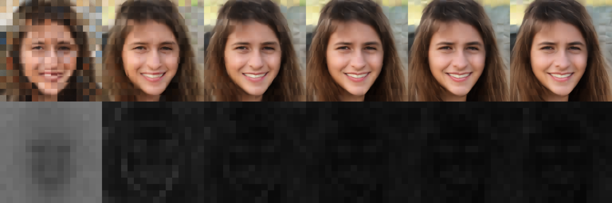
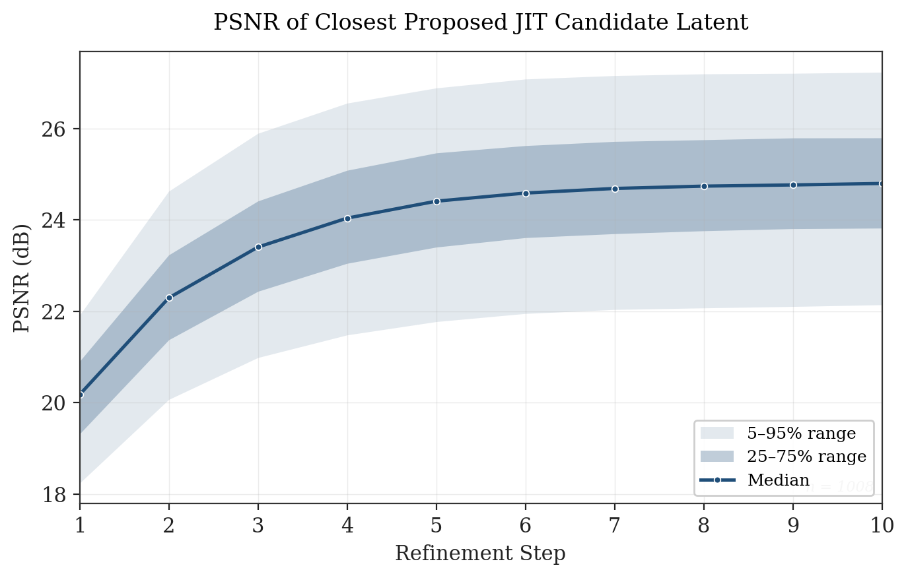
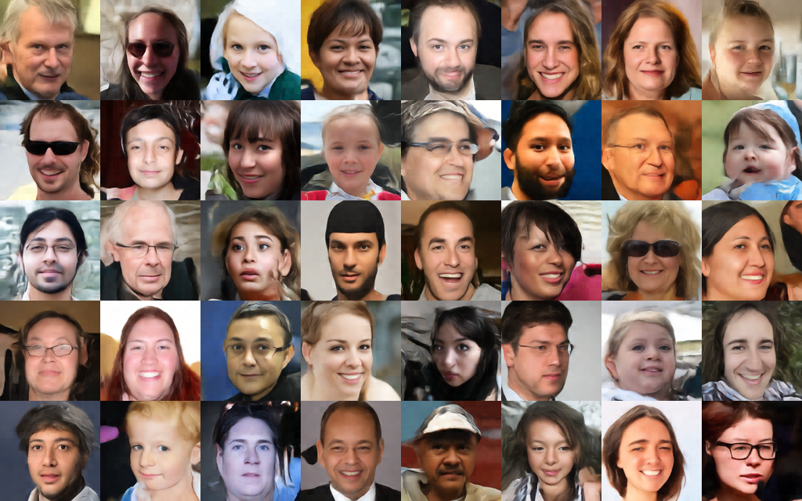
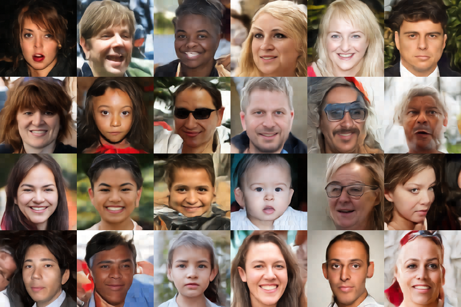
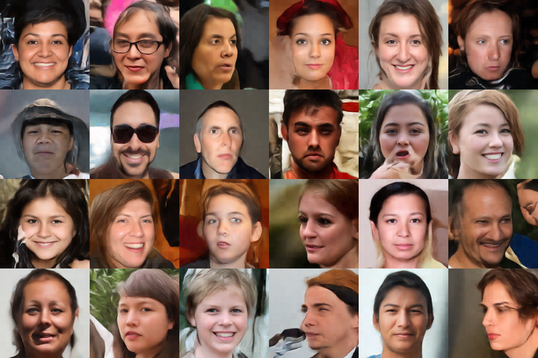
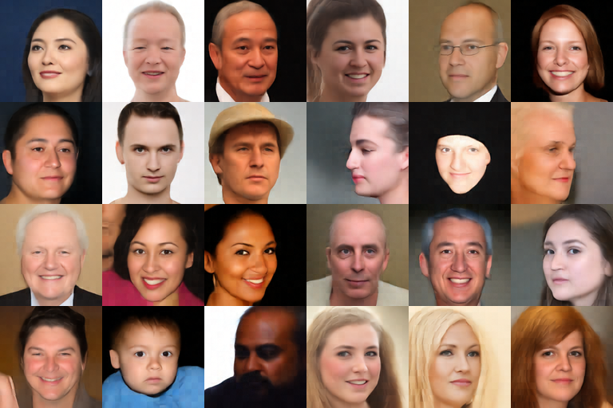
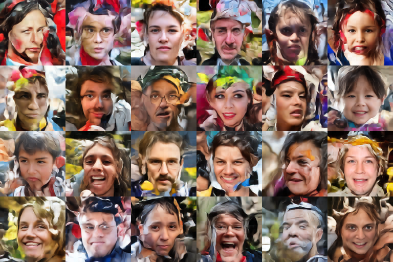

# Just-In-Time Dynamic Codebooks for Generative Modeling
### Per-patch candidate generation with single-head multiple-choice learning
Eugene Raether, AI Engineer & Researcher @ Qualia Tensor LLC

## Foreword

This is a portfolio piece. It documents a generative modeling project I built and trained solo on a single GPU over several weeks, and it's written for a few different readers at once -- researchers, engineers, and hiring managers -- so a quick orientation is in order.
I developed these ideas independently while working on the project. Some of them may have prior art I haven't yet found, and I've tried to flag where that's most likely. Where I claim something is novel, I mean it survived my own search -- not that I'm certain no one else has done it.
If you're a recruiter or hiring manager, the short version is that I designed, trained, and debugged a three-stage model stack end-to-end on consumer hardware, and the results below are the artifact. If you're a researcher or engineer, the technical sections are where the interesting questions live, and I'd genuinely enjoy hearing what you think.
My contact information is at the bottom. Thanks for reading.

## Key Contributions (What's New Here)

### Likely Genuinely Novel

1. Single-head multiple-choice learning, which allows for MCL without head balancing or additional loss terms
2. The model stack presented here: MaskGIT-style iterative refinement over a regenerated continuous codebook produced by single-head MCL.

### Potentially Novel

1. GCNN self-attention, which, in this project, resulted in training convergence to the same loss roughly **~2x faster over flash-attention-2** based on actual wall clock time (**~2.5x less steps**).  While @torch.compiled, there was no custom cuda kernel written for this implementation, which implies that the true speed improvements could, potentially, be even higher.

## The Idea in One Paragraph

Existing generative models largely pick one of two tradeoffs. VQ-VAEs quantize against a fixed global codebook, which introduces quantization error and tends toward codebook collapse as vocabularies grow. Diffusion and flow models predict a denoising target at each step that, under common training objectives, tracks the conditional mean -- which in the few-step regime tends to smear across nearby modes rather than commit to one. This project proposes a third option: for each spatial patch, generate a small *local* codebook on demand -- 16 per-token candidate latent vectors conditioned on the current context -- then sample categorically from those 16 one by one. After all patches are sampled, generate the next set of plausible continuations anchored on the current state of the refinement process.  This iterative refinement means that the codebook is never fixed and never global, but instead conditional. It is just-in-time and per-token.

## A Single Output Head

The central technical contribution of this project is **multiple-choice learning from a single output head.** Standard MCL uses one head per candidate with careful loss balancing to keep heads from dominating one another. This project produces 16 candidates through a shared pathway, such that every model parameter receives a gradient from every sample -- no balancing losses, no per-head bookkeeping.

Three properties follow from the design:

**No quantization error.** The 16 candidates are continuous latents generated per-patch, not indices into a frozen table. There is no global vocabulary to collapse or outgrow.

**No intrinsic pull toward the conditional mean.** The model is not asked to predict E\[x|context\]; it is asked to propose a small set of plausible x's, where loss is actually higher if the plausible guesses are unnecessarily clustered.  However, this balancing is entirely based on a single reconstruction loss, rather than any additional loss terms.

**Centroids, not modes.** Because there is not infinite capacity to model all possible modes under ambiguity (only 16 continuous latents are proposed, rather than all possibile continuations), the reconstruction loss results in centroids, not modes.  However, this still results in many distinct centroids, rather than a single global mean.

---

### How a Single Head is Possible

The short answer is noise.  The candidate generator is three stages of attention with non-parameteric noise injected in the middle.

**Global attention.** All 256 (16x16) patch hidden states attend to each other bidirectionally (12 layers). Captures global structure and conditioning.  Uses GCNN attention.

**Candidate expansion via noise.** Each hidden state is expanded into 16 noised copies by passing noise through an MLP and adding it to the hidden state (similar in spirit to a GAN's z-network). A single hidden state becomes 16 distinct noised latents (1 layer). (BxLxC -> BLx16xC')

**Intra-patch attention.** The 16 noised latents for each patch attend *only to each other* -- never across patches. Because they see each other, they can coordinate to cover the local conditional distribution rather than all landing on the same answer. (8 layers)

The 16 candidates are not modes in the strict sense. They are 16 points that jointly minimize expected closest-candidate loss against whatever the ground-truth latent turns out to be.  They are, effectively, 16 centroids covering the local conditional distribution.

---

### Why the 16 Candidates Don't Collapse

Head collapse, the classic MCL failure mode, cannot happen here in the usual form because there are no separate heads. All 16 candidates are produced by the same parameters. There is nothing to optimize or dominate because the exact same MLP produces all 16 candidates, and the noise itself cannot be optimized because it is simply that.  Noise.  A gradient that improves one candidate improves the pathway for all of them.

What remains is the softer version of the problem: *candidate starvation*, where some noise regions map to outputs that never win and therefore don't receive useful gradient, collapsing the effective candidate count below 16. Two design choices push against this:

1. **Intra-patch attention after noise expansion.** The 16 candidates see each other before they are scored. If several are near-duplicates, attention has the capacity to repel them -- duplicates don't help minimize closest-candidate loss, and diversified candidates do. (Capacity, not guarantee.)

2. **Input mixing at the refinement boundary.** The input to each refinement step is usually the closest candidate from the previous step (90%), or a random candidate from the previous step (10%).  Because the model is forced to use its own bad guesses, this naturally leads to the model being robust to drift and to have built in error correction.  Also, this process encourages the latent generation process to generate useful latents in the abstract, as that is what tends to minimize loss, even if there is no BPTT.

The practical claim is not that all 16 slots stay maximally spread; it's that the model learns to spread candidates when its current estimate is uncertain and tighten them when it's confident. Early refinement passes produce scattered candidates; later passes produce clusters near the likely answer. Per-token entropy drops accordingly.  This is directly observed below.

### Visualization of the Mechanism

The diagram shows the following.  The bottom row shows the per-patch variance of the generated candidate latents.  The top row shows the decoded latents after a single additional full pass (bidirectionally sampling all 256 latents one by one).

As you can see, initially, the variance is very high (as the latent generator has zero context).  However, the variance rapidly plummets in most areas of the image as the model goes from 'generative mode' to 'refinement mode'.  This makes sense from a mutual information standpoint.  Most of the difficulty in generation is the global structure.  Once the global structure exists, most information is local refinement.  (This is what hierarchical VQVAEs bank on).

Interestingly, the variance of the latents that make up the face are lower unconditionally.  This is almost certainly an artifact of the FFHQ face centering, and would unlikely show up in a less structured dataset. 

While the above shows the variance, the following diagram shows the PSNR of the Latents themselves.  Note that this is in tanh latent space, not color space.

This suggests that most of the value is captured with 8 refinement steps, with the variance too high to meaningfully converge beyond 8.  I hypothesise that this might be due to an overly aggressive training regime, where 0-20% of the time, a random candidate latent is chosen instead of the closest candidate latent.  This seems to affect the tailend convergence, resulting in a lower final PSNR (the tradeoff being that the model is more resistant to recovering from early mistakes).

---

## Pipeline Overview

### Stage 1 -- Continuous Autoencoder (~300M params)
- **Purpose:** Learn a structured latent bottleneck.
- **Architecture:** 6 GCNN-ATTN encoder layers → tanh bottleneck (128 dim) → 6 GCNN-ATTN decoder layers.
- **Loss:** Smooth L1.
- **Training:** 3 hours on 1×4090.

[Link to Autoencoder](./code/stage_1_autoencoder_simple_ae_cnn_attn.py)

### Stage 2 -- Just-in-Time Candidate Generator (~450M)
- **Purpose:** Produce 16 candidate latents per patch that cover the local conditional distribution.
- **Architecture:** 12 GCNN-ATTN layers operating globally at width 1024 → noise MLP expanding each position into 16 noised hidden states → intra-patch self-attention (8 layers).
- **Loss:** Smooth L1 between ground-truth latent and closest candidate, with 90/10 winner/random input mixing at refinement boundaries.
- **Training:** 20 hours on 1×4090.
- **Initial input at inference:** zeros (supports conditional prompting if desired).

[Link to Candidate Generator](./code/stage_2_latent_generator_16x16_mask_git_iterative_big.py)

### Stage 3 -- Categorical Selector (~1.1B params)
- **Purpose:** Given 16 candidates per patch, pick one.
- **Architecture:** 12 GCNN-ATTN layers (global) → linear projection to 16 logits per patch.
- **Loss:** Cross-entropy against the index of the candidate closest to the ground-truth latent.
- **Training:** 21 days on 1×4090.

Total training: roughly 22 days on a single 4090.

## Inference: Iterative Refinement

Terminology, since "step" gets overloaded:

- **Token:** one of the 256 patches in the 16×16 latent grid.
- **Full Pass:** Stage 2 runs once (regenerating 16 candidates for every patch), then Stage 3 runs 256 times, one patch at a time -- 256 token-generations.  257 forward passes total.  Adaptive-order (entropy-based) autoregression.
- **Refinement Pass:** Stage 2 runs once, and Stage 3 resamples all 256 patches in parallel as a single operation. 2 forward passes total.  Very hierarchical vqvae-like.

During the full pass, the index of which token to sample is based on **minimum entropy**.  Aka, the most confident token is the one that's chosen to be sampled next.  Because the codes are 'just-in-time', no top-p or top-k is used because all candidates should be relevant.  Temperature is kept at 1.0.  This, empirically, leads to better sampling.  However, there are also ablations using random sampling.

Inference is optimized using @torch.compile and bfloat16 autocasting.  Since this project uses bidirectional attention, there is no KV-caching.  Making attention causal would moderately improve inference speed, but makes entropy-based sampling impossible, and would likely result in worse output.  Bidirectional attention was considered a worthwhile tradeoff because a 256 token context length is quite short.

The sampling rate is roughly ~100 it/s for a batch size of 1, or ~45 it/s for a batch size of 4, with the majority of the sampling time taken up by Stage 3.

Also, a secondary note.  Stage 3 was only trained using 4 refinement steps, and 6 refinement steps were used at inference because quality visually continued to improve.  However, training stage 3 with 8-12 refinement steps would likely be far more optimal (but would result in ~2x-3x longer training time).

The intermediate version between these two extremes (adaptive-order autoregression and full-parallel sampling), would be to sample in batches (e.g. MaskGIT-like).  I believe this is likely the broadly correct answer, and depends on an empirical assessment of mutual information at each stage.  Low mutual information means high parallelization, high mutual information means low parallelization.  Finding the right balance minimizes inference time while maintaining sample quality.  Mutual information cannot directly be computed from entropy, however.

## Inference
6 full passes, 0 global refinement passes, entropy-based sampling

Due to low number of full passes, the output remains blurry.  Still, there is good global structure forming.  The faces have less entropy than the background, and are therefore easier to generate with fewer full sampling steps.

## Inference Ablations

1 full pass (1+256), 9 global refinement passes (9+9) = 10 stage 2, 265 stage 3 forward passes, entropy-based sampling.  5.6x speedup over 6 full passes:

A lack of some global structure can be seen.  Eyes differing sizes, hair is two-toned, etc.

----

6 full passes 0 refinement passes (6 stage 2, 1536 stage 3 forward passes), but selecting which spot to sample is chosen randomly, instead of based on lowest entropy:

More artifacting compared to sampling the lowest-entropy tokens first.

----
Entropy sampling, 6 full passes, 0.5 temperature:

Very simple backgrounds.

----

Entropy sampling, 6 full passes, 1.5 temperature:

Chaotic, dream-like outputs.

---

## Architecture Notes: GCNN-ATTN

Discard all notions of what 'convolutional attention' is, because this is not that.  Convolutional attention is conceptualized as local attention, which this is not.  The simplest way to think about this is to imagine the 2d key state being unfolded into patches, each query being linearly up-projected into a patch, and taking the Frobenius inner product between all queries and all keys in a multihead attention fashion.

This operation is a strict superset of attention, with normal dot product attention recovered if the expanded query is a kernel with zeros in all indices except the middle-most one (assuming all dimensions are odd).  Similarly, if the kernel size is 1x1, then this is exactly equivalent to standard multihead attention.

Because spatial structure is already encoded through this patchification process, the project uses learned absolute position embeddings rather than RoPE.

This appears to be a very powerful inductive bias, as non-optimized (but compiled) pytorch code implementing this converges roughly 2x **faster** than the flash-attention-2 variant based on wall-clock time to reach the equivalent loss.

Optimizer: schedule-free.

---

## Tradeoffs

The honest cost: this is slower than few-step diffusion. 256 patches × 6 full passes is 1536 sequential token-generations per image. At 100 it/s, that's roughly 15 seconds for a single image -- several times slower than a modern few-step diffusion model on the same hardware.  With a batch size of 8, this becomes 25 it/s, or 7.5 seconds per image.   The 1x full pass ablation hints that it might be possible to recover most of the value from the single, structural forward pass -- but at that point this is not inherently different from a vqvae, as the dynamic quantization does not outperform until at least the second refinement step.

The pitch is that you trade inference speed for mode coverage and quantization-free latents. Whether that tradeoff is worth it depends on the application.  As stated, this can be likely massively improved through MaskGIT-like inference, but would require tweaking schedules.  Or, more optimally, having a prediction of mutual information.

## FID / IS

The goal of this project is not to produce photorealistic images, it is to demonstrate novel techniques (the just-in-time codebook).  Indeed, to have latents converge to imperceptibility requires roughly ~12 full passes, while only the first 4 were trained on.  Nevertheless, FID / IS is run for completeness' sake.

FID run on 5000 output images:  66.27; calculated using `torch_fidelity`.
The score is likely high due to artifacting / patch edge boundaries when decoding, but also simply due to the nature of not having enough full passes.  The artificating / patch edge boundaries can be ameliorated using a regression model trained to decode partially converged latents instead of using the autoencoder decoder (which expects perfect latents).  Indeed, even something like jpeg noise can increase the FID from 0 to 20+, despite having high PSNR and limited perceptual difference: [link](https://www.cs.cmu.edu/~clean-fid/).  I would estimate training this regression model might drop FID from 66 to ~30.  But to drop FID further would require more refinement steps.

IS on 5000 output images: 3.759 ± 0.062
For reference, stylegan2 has an IS of 5.13 ± 0.02
It is difficult to interpret this value.  I find it likely that, due to the unconverged backgrounds in these outputs, that InceptionV3 classifies these images into a smaller variety of classes, rather than this being an issue of mode collapse.

## Next Steps For This Project

0. Publish the code and utilities used in this project.  Currently requires some refactoring. (~5 hours)

1. Train a regression model to improve output quality and fix patch boundary details for partially converged latents as a temporary fix, should produce significantly better FID scores (~5 hours)

2. Continue training the Stage 3 categorical predictor -- on 12 full passes instead of 4. (~10 days)

3. Train the categorical predictor using standard self-attention.  While the inductive bias for GCNN attention is extremely useful in the autoencoder and the dynamic codebook generator, and resulted in initial faster convergence in the categorical predictor case, it's possible that, at the limit, it is slower compared to standard self-attention.  As stated, GCNN is a superset of attention, and so GCNN is unlikely to perform worse, but it is also computationally slower. (~20 days)

4. Do a deeper dive into GCNN-ATTN (TODO: Review Involution  (Li et al., CVPR 2021), Lambda Networks (Bello, ICLR 2021), HaloNet (Ramachandran et al. 2019, Vaswani et al. 2021), to ensure genuine novelty

---

## Data and Licensing

**Source code:** personal copyright, all rights reserved.

**Dataset (FFHQ):** not included in this repository. FFHQ is distributed by NVIDIA under CC BY-NC-SA 4.0 -- non-commercial, attribution required, share-alike on derivatives of the dataset. As no images or code from FFHQ are included in this repository, the FFHQ license does not apply, in whole or in part, to any part of this project.  However, if you choose to run your own experiments, keep the license in mind.  Obtain it from the official NVIDIA FFHQ repository.

**Generated results:** under current USCO guidance, purely machine-generated outputs without human authorship are not eligible for copyright protection in the US. The sample images above are provided for demonstration and are not claimed under copyright. This concerns the copyright status of the *outputs* and does not itself resolve questions about downstream use given FFHQ's non-commercial training-data license.  Nor does it apply to the ideas or code.

**Model weights:** The examples exist to demonstrate that the technique works, not as a meaningful distributable artifact.

## Citing

The repo is source-available, not open-source, and is meant to be part of a personal portfolio.  If you come across this and are interested, please reach out at {first}.{last}@{yahoo}.com  I would love to work with you!
