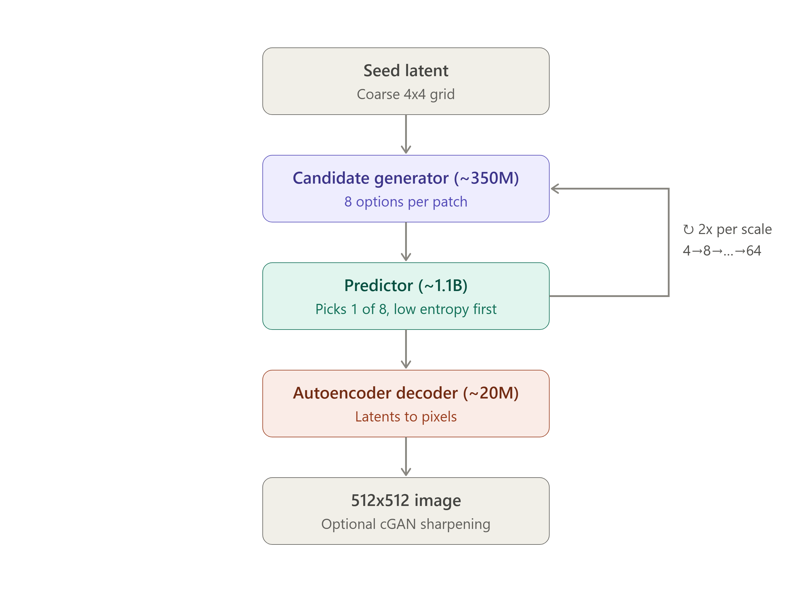

# Headless Multiple-Choice Learning

## Winner-take-all hypothesis sets without heads, and a generative pipeline built out of them

**Eugene Raether** -- AI Engineer & Researcher, Qualia Tensor LLC


---

## Abstract

Multiple-choice learning (MCL) trains a set of *k* hypotheses under a winner-take-all (WTA) loss, so that the set covers the ambiguity of a task rather than collapsing to its conditional mean. The standard instantiation gives each hypothesis its own output head -- a distinct set of parameters -- and this is where the trouble starts. A head that wins early receives more gradient, improves, and wins more; heads that lose early receive nothing and freeze at initialization. The field's response has been a family of compensations -- ε-relaxation, winner-usage regularizers, top-*n* assignment -- all of which amount to manually redistributing the gradient that the WTA loss withheld.

This report describes a parameterization that removes the cause rather than compensating for it. There are no heads. Each input's hidden state is **replicated *k* times**, each replica is perturbed with **independent noise**, the replicas **attend to one another**, and a **single shared projection** maps every replica to a hypothesis. The loss is plain WTA -- smooth L1 to the closest hypothesis -- with no auxiliary term of any kind. Three properties follow structurally: no parameter can starve, because every parameter is on the gradient path of every hypothesis; the hypothesis set is permutation-equivariant, which is the correct symmetry for what is inherently an unordered set; and diversity emerges from the objective itself, because duplicated hypotheses strictly waste capacity under a min-loss. Under this training, the hypotheses converge toward the centroids of an optimal *k*-cell partition of the conditional distribution -- a **conditional vector quantizer, computed on demand** -- and pairing them with a learned scorer turns the set into a proper conditional density estimator.

The construction is then put under load. **Just-in-time dynamic codebooks** is a complete image generation method in which the headless hypothesis set does the job normally done by a fixed codebook: rather than one context-free vocabulary shared by every position and every step, a headless-MCL generator emits eight candidate latents *per position, per step*, conditioned on the current partial generation, and a second network does ordinary categorical prediction over them. Because the vocabulary is conditional, every entry occupies a cell of the local conditional and there is nothing to truncate: sampling proceeds at temperature 1.0 over eight logits, with no top-k, no top-p, and no guidance term. The application is demanding in exactly the ways that test the parameterization -- the hypothesis set is regenerated millions of times, consumed by a downstream model, and chained through its own outputs for ten steps -- and it surfaces the construction's fundamental limit: a hypothesis set used as a sampling channel transmits at most log₂(k) bits per selection, which produces a measurable fidelity plateau and dictates the two escape routes (a resolution hierarchy, and an adversarial refiner) that the current pipeline uses.

Two full systems were built. The first -- a single-scale stack on a custom convolutional self-attention variant, its 1.1B predictor alone trained over 15 days on one GPU -- established the method's behavior and exposed the plateau. The second, currently training, is the hierarchical pipeline that the plateau analysis dictates: generation proceeds 4x4 → 64x64 across ten refinement steps before decoding to 512x512. Everything here -- three model families, a custom attention implementation, the full inference stack, and the ablations -- was designed, implemented, and trained end-to-end on a single RTX 4090.

---

## 1. Introduction

### 1.1 The head problem

Many prediction problems are ambiguous: given the context, several answers are valid, and a model trained by regression produces the mean of the valid answers, which is frequently not itself a valid answer. Multiple-choice learning [7] addresses this by training *k* predictors under a loss that only penalizes the best one. The winner improves toward the target; the losers are free to cover other outcomes; the set as a whole spreads to cover the ambiguity. sMCL [8] made this practical for deep networks trained by SGD, and Rupprecht et al. [9] applied it broadly to ambiguous vision tasks.

The standard architecture is *k* parallel output heads on a shared trunk. Head
*i* is a distinct set of parameters, and hypothesis *i* is whatever head *i* produces. This creates a positive feedback loop that every practitioner of MCL knows: a head that wins more often receives more gradient, becomes better, and wins more often still, while heads that lose early receive essentially no gradient and remain frozen near initialization. The literature's mitigations -- ε-relaxation (give the losers a small share of the gradient), entropy or usage regularizers on the winner histogram, top-*n* instead of top-1 assignment -- are all mechanisms for manually redistributing gradient across heads. They treat the symptom. The cause is that hypothesis identity is *index-addressed*: "hypothesis 3" is a fixed subset of the model's weights, and whether those weights train depends on whether index 3 happens to win.

There is a second, subtler cost. The target of MCL is an unordered set -- the task defines which *outcomes* should be covered, not which *index* should cover which outcome -- but a multi-head model must break that symmetry through learning, spending capacity and training time discovering an arbitrary assignment of indices to regions of outcome space.

### 1.2 The proposal: remove the heads

The parameterization studied here has no per-hypothesis parameters at all:

1. All inputs pass through a **shared trunk**, where they mix.
2. Each input's hidden state is **replicated k times**.
3. **Independent noise** is added to each replica. The noise is the *only*
   thing distinguishing the replicas at this point.
4. The k replicas **attend to one another** -- attention across the hypothesis
   axis, not across inputs.
5. A **single shared projection** maps every replica to a hypothesis.

The loss is winner-take-all with no auxiliary term: no diversity loss, no usage regularizer, no ε-relaxation, no per-head weighting.

Three properties follow directly, and §3 develops each. No head can starve, because there is no subset of weights that belongs to a losing index. The hypothesis set is permutation-equivariant by construction, which is the right symmetry for the problem and never has to be learned. And diversity is a consequence of the objective rather than a constraint imposed on it: under a min-loss, two replicas producing the same output strictly waste one of them, and the inter-replica attention gives the model the mechanism to notice and avoid this.

I will refer to this construction as **headless MCL**. It is the substantive contribution of this report, and the one I consider most likely to generalize:
§8 sketches direct applications in robotics and language modeling.

### 1.3 The stress test: a generative pipeline whose vocabulary is a hypothesis set

A parameterization claim of this kind is cheap to state and expensive to validate. The validation offered here is a complete generative system in which the headless hypothesis set is not a diagnostic curiosity but the load-bearing component -- regenerated millions of times during training, consumed by a downstream network, and chained through its own outputs at inference.

The application domain is discrete autoregressive image generation, and the opening for it is a specific design decision that the whole VQ family shares. Discrete autoregressive methods (VQ-VAE, VQGAN, MaskGIT, VAR) quantize the latent grid against a learned codebook and model the resulting token sequence with a categorical likelihood. The codebook is **fixed and context-free**: a single quantization of latent space shared by every spatial position and every generation step. Consider what one of its entries has to be -- a single vector that must serve as the best available approximation of some latent, at any position, in any image, at any point during generation. The codebook therefore has to tile the *marginal* distribution of latents over the whole dataset. But at sampling time, the quantity that matters is the *conditional* -- the distribution of this latent given the surrounding context that has already been fixed. Once the model has committed to a face at a given scale and to hair color in the adjacent patches, the set of plausible values for the next latent is very small. Nearly the entire codebook is irrelevant.

This mismatch is visible in the standard workarounds. Codebooks are made large (1024–16384 entries) so that the marginal is covered finely enough; then, at sample time, top-k or nucleus truncation throws most of the distribution away, because the softmax over a marginal-covering vocabulary assigns non-trivial mass to entries that are contextually absurd. Codebook collapse -- where most entries receive no gradient and die -- is the same problem from the training side: an entry is only useful if it is near enough to *some* latent, in a metric that knows nothing about context.

Notice that codebook collapse and head starvation are the same disease in two bodies: a fixed, index-addressed set of representatives, some of which stop receiving gradient because assignment is winner-take-all over a set whose members have persistent identities. Headless MCL was built to cure the second;
**just-in-time dynamic codebooks** applies the cure to the first.

The method: do not learn one codebook -- learn a function that *emits* a codebook. At each spatial position, at each step of generation, a headless-MCL network takes the current partial latent grid and produces k = 8 candidate latent vectors specific to that position and that context. A second network produces a categorical distribution over those eight candidates, one of which is sampled and written into the grid. When context changes, the candidates are discarded and regenerated. Nothing is stored between steps -- so there is no persistent codebook to collapse, and, because every entry occupies a cell of the local conditional, there is no implausible tail to truncate. Sampling uses temperature 1.0 over eight logits, with no top-k, no top-p, and no guidance term.

### 1.4 Contributions

1. **Headless MCL.** A parameterization that produces *k* winner-take-all
   hypotheses from one output head, by replicating each input, injecting
   independent noise per replica, and applying self-attention across replicas
   before scoring. This removes the need for per-head loss balancing,
   ε-relaxation, or head-usage regularizers, and makes the hypothesis set
   permutation-equivariant rather than index-addressed.

2. **An account of what the hypotheses are -- and why a scorer is structural.**
   Under WTA training the hypotheses converge to a distortion-optimal
   *k*-point quantization of the conditional distribution: a conditional
   vector quantizer, not a set of samples and not a set of modes. Because the
   tessellation is optimized in *distance* rather than in *mass*, the
   hypothesis set alone is not a density estimator; a trained scorer over the
   cells is a structural requirement, not an optional refinement (§3.3, §4.7).

3. **Just-in-time dynamic codebooks.** A generative pipeline in which the
   discrete vocabulary is a headless hypothesis set regenerated per position
   and per step from context, rather than learned once and shared globally.
   This eliminates codebook collapse as a failure mode and eliminates
   sampling-truncation heuristics, and serves as an end-to-end stress test of
   the parameterization.

4. **The capacity ceiling of hypothesis-set sampling.** A refinement chain
   built on hypothesis selection resolves mutual information between tokens
   quickly and then plateaus. I first attributed the plateau to a noisy
   training regime; testing that hypothesis directly falsified it. The
   remaining explanation is information-theoretic -- a selection among k
   hypotheses transmits at most log₂(k) bits, so per-token residual detail
   cannot be resolved in the available number of steps -- and it predicts the
   two escape routes the current pipeline actually uses (§6.5).

5. **Two full working systems.** A complete single-scale system built on a
   custom convolutional self-attention variant (with a 1.1B predictor),
   trained to the point where its behavior -- and its ceiling -- could be
   characterized precisely; and the hierarchical successor designed around
   that analysis, with multi-scale scheduling, a hybrid attention/convolution
   predictor, and receptive-field-exact parallel sampling at the scales where
   it applies.

### 1.5 Scope

This is an independent, self-funded research project, designed, implemented, and trained end-to-end on a single RTX 4090. That constraint shaped the scoping deliberately rather than incidentally. FFHQ at 512x512 was chosen because it is a dataset on which models of this class can actually be trained to signal on this hardware -- the point of the project is to test a mechanism, and a dataset that cannot be trained to convergence tests nothing. Where FFHQ's structure leaks into the results (its aggressive alignment and centering shape the spatial statistics of candidate variance in §4.6), I flag it.

This is a research and engineering writeup, not a publication. There is no baseline trained under matched conditions -- and under this report's framing the most important missing baseline is a matched *multi-head* MCL model, since the headline claim is about the parameterization (§9.1 puts it first in the experiment queue). The hierarchical pipeline is still training: the coarse-scale predictor is mid-run and the fine-scale predictor has not started. Where a claim outruns the current evidence, I say so and name the experiment that would settle it.

---

## 2. Related work and positioning

### 2.1 Multiple-choice learning and winner-take-all training

MCL [7] trains an ensemble of predictors under a loss that only penalizes the best one, so that the ensemble covers the ambiguity of the task rather than collapsing to its conditional mean. sMCL [8] made this practical for deep ensembles trained by SGD, and Rupprecht et al. [9] applied it to ambiguous vision tasks, introducing the ε-relaxation (give the losers a small share of the gradient) that has since become standard for keeping unused hypotheses alive. All of this work parameterizes the hypotheses as separate heads, and all of the balancing machinery exists because of that choice. The parameterization in §3 is positioned directly against it: same objective, no heads, no balancing.

The theoretical results that matter most here connect WTA training to centroidal Voronoi tessellation: at optimum, the hypotheses of a WTA learner quantize the shape of the conditional distribution, and can be turned into a proper conditional density estimator by pairing them with a scoring function over their Voronoi cells [10, 11]. That is a precise description of what the two-stage design in §4 does -- the generator produces the tessellation, the predictor scores the cells -- and I found this literature after building the pipeline rather than before. It provides the right vocabulary: the hypotheses are not modes, they are a **conditional vector quantization**, and the scorer supplies the probability mass that the geometry alone does not carry.

### 2.2 Implicit maximum likelihood estimation and particle methods

IMLE [12] trains an implicit generator by drawing a pool of samples, matching each *data* point to its nearest *generated* sample, and pulling the generator toward the data. Reversing the direction of the nearest-neighbor assignment relative to a GAN-style objective is what makes IMLE mode-covering rather than mode-seeking: every data point is guaranteed a nearby generated point, so dropped modes are penalized directly.

Per-input, the headless objective is the conditional analogue of that: draw k outputs from noise, take the nearest to the ground truth, regress it toward the target. The difference is that IMLE's samples are drawn independently, so coverage emerges only in expectation over many draws and large sample pools.
The inter-replica self-attention of §3.2 makes the k samples aware of each other within a single forward pass, which is what converts an independent sample pool into a coordinated tessellation -- and is why k = 8 suffices in the application where independent sampling would need far more.

The mechanism is also reminiscent of particle variational methods such as Stein variational gradient descent [13], where a fixed set of particles is driven toward a target by a gradient term plus an analytic repulsion kernel that keeps them apart. The distinction is that the repulsion here is *learned*
-- it is whatever the attention layers find useful for minimizing expected closest-hypothesis error -- rather than a fixed isotropic kernel. The analogy is intuition for why the hypotheses spread out rather than collapsing, not a formal correspondence.

### 2.3 Fixed-vocabulary discrete generation

VQ-VAE [1] established the two-stage recipe: learn a discrete latent space by nearest-neighbor quantization against a learned codebook, then fit an autoregressive prior over the resulting token grid. VQ-VAE-2 [2] made the latent hierarchical, with a coarse grid capturing global structure and a finer grid conditioned on it -- the observation that most of the difficulty is global and most of the information is local, which the present method also relies on. VQGAN [3] added adversarial and perceptual losses to the decoder, which is what made the reconstruction quality competitive at low token counts.

MaskGIT [4] changed the decoding order: instead of raster-scan autoregression, it iteratively unmasks tokens in parallel, choosing which to commit based on confidence. The parallel decoding is an approximation -- tokens committed in the same round are sampled from independent marginals despite being statistically dependent -- but it is a very effective one, and the confidence-ordering idea is directly reused here.

VAR [5] restructured autoregression as next-*scale* prediction, generating an entire token map at each of a series of increasing resolutions. The coarse-to-fine schedule in §4.3 is the same idea, and VAR is the closest published work in terms of overall generation structure. The difference is what happens inside a scale: VAR predicts over a fixed multi-scale codebook, while this work regenerates the vocabulary at every step.

The common thread is a codebook shared across all contexts. Every technique above inherits the marginal-versus-conditional mismatch described in §1.3, along with the collapse and truncation workarounds that follow from it.

### 2.4 Continuous per-token distributions

MAR [6] is the most direct point of comparison for the application, and occupies the same architectural slot. It keeps the masked-autoregressive backbone but removes the quantizer, modeling the per-token distribution with a small diffusion MLP head and a denoising loss in place of cross-entropy. The framing in that paper -- that autoregression over tokens and the per-token density are separable design choices -- is exactly the framing I would use for this project. Where MAR fills the per-token slot with an implicit continuous density, this work fills it with a headless hypothesis set plus a scorer.

| | MAR | This work |
|---|---|---|
| Per-token density | Continuous, implicit (diffusion) | k-point discrete quantization of the conditional |
| Head evaluation cost | Many denoising steps per token | One forward pass produces all k candidates |
| Sampling from the head | Iterative | Single categorical draw over k logits |
| Support | Unbounded | Exactly k points, each a cell of the conditional |
| Fidelity ceiling | Set by diffusion head capacity | Set by k and the number of refinement steps (§6.5) |

The discretization is a genuine cost: it imposes a hard resolution floor that MAR does not have. The compensating benefit is that once the candidates exist, the entire sampling machinery of categorical AR modeling applies unchanged, and head evaluation is a single forward pass rather than a denoising loop.

### 2.5 Summary of positioning

Relative to the MCL literature, this work contributes a parameterization of the hypothesis set that makes load balancing unnecessary and hypothesis identity meaningless. Relative to VQ-family methods, it removes the fixed codebook -- replacing it with a per-step hypothesis set -- and with it the truncation heuristics and collapse pathology. Relative to MAR, it replaces an implicit continuous head with an explicit k-point conditional quantizer, trading unbounded support for single-pass head evaluation and categorical sampling.

---

## 3. Headless MCL

This section is the core of the report. It defines the objective, the parameterization, and the two structural facts -- the distance/mass gap and the log₂(k) selection channel -- that every downstream design decision in §4–§7
follows from.

### 3.1 The objective, and what the hypotheses are

For an input with context *c* and ground-truth target *y*, the model produces hypotheses `{ŷ₁ … ŷ_k}` and the loss is

```
L(c, y) = min_i  smooth_L1(ŷ_i, y)
```

Only the winner is penalized. No auxiliary term of any kind: no diversity loss, no usage regularizer, no ε-relaxation, no per-head weighting.

Under this loss, the optimal hypothesis set minimizes expected closest-hypothesis distortion over the conditional distribution p(y | c). That is the defining property of a **k-point vector quantizer of the conditional**, and the fixed points of the corresponding gradient flow are centroidal Voronoi tessellations of p(y | c) [10, 11]. This is worth stating precisely, because it disciplines what may be claimed:

- The hypotheses are **not** k samples from p(y | c).
- The hypotheses are **not** k modes of p(y | c).
- The hypotheses **are** k points that jointly minimize expected distortion --
  the centroids of an optimal k-cell partition of the conditional.

A bounded target space makes this training markedly better behaved: WTA on an unbounded target lets an outlier drag a hypothesis arbitrarily far, and the hypothesis that chases it is effectively removed from the tessellation. The application in §4 engineers its latent space (a tanh bottleneck) specifically to provide this bound.

### 3.2 The parameterization

Standard MCL instantiates k separate output heads. Head *i* is a distinct set of parameters, and hypothesis *i* is whatever head *i* produces. This creates the positive feedback loop of §1.1: winners accumulate gradient, losers freeze, and practitioners intervene with ε-relaxation, entropy regularization on the winner histogram, or top-n assignment -- all mechanisms for manually redistributing gradient that the WTA loss withheld.

The headless parameterization has no per-head parameters at all:

```
input
  → shared trunk                       (inputs mix; task-appropriate architecture)
  → replicate hidden state kx
  → add independent noise per replica
  → self-attention across the k replicas   (hypothesis axis, not input axis)
  → shared output projection
  → k hypotheses
```

Three properties follow directly.

**No head can starve.** Every parameter in the model is on the gradient path for every hypothesis, so every parameter is updated by whichever hypothesis wins, every time. There is no subset of weights that can go un-trained because its hypothesis never wins. The failure mode that ε-relaxation exists to prevent is absent from the parameterization, not suppressed by an extra loss term.

**The hypothesis set is permutation-equivariant.** Hypothesis identity comes only from the noise draw, so there is no persistent "hypothesis 3." Relabeling the noise draws relabels the outputs and changes nothing else. This is the right symmetry for the problem -- the target is an unordered set of centroids -- and imposing it structurally means the model never spends capacity learning it. It also means that index-based diagnostics from the multi-head MCL literature (winner-usage histograms, per-head utilization) are not merely unnecessary here but undefined: marginalized over noise, every index is exchangeable by construction.

**Diversity is a consequence, not a constraint.** If two replicas produce the same output, one of them is wasted: the loss is the *minimum* over hypotheses, so duplicated hypotheses strictly increase expected distortion relative to spreading out. The inter-replica attention gives the model the mechanism to detect and avoid duplication -- each replica can observe what the others are proposing and move away -- and WTA supplies the incentive. No explicit diversity term is needed, and none is used. §7 provides the instructive contrast: an adversarial model in the same pipeline where diversity *does*
have to be enforced by an explicit loss, and is correspondingly fiddly to tune.

The noise plays a role worth naming: it is a symmetry-breaking source, not a latent variable in the usual generative sense. There is no requirement that the map from noise to hypothesis be smooth or that particular noise values correspond to particular semantics. Its only job is to give the attention layer something to differentiate the replicas by. The attention is what turns k independent perturbations into a coordinated tessellation -- the learned analogue of the fixed repulsion kernel in particle methods (§2.2) -- and it is why small k suffices where independent sampling (IMLE-style) would need far more draws to cover the same conditional.

### 3.3 The distance/mass gap: why a scorer is structural

The tessellation is optimized in *distance*, not in *mass*. Nothing in the WTA objective equalizes the probability of the Voronoi cells the hypotheses induce, and in general it will not be equal: a rare but geometrically distant outcome (an unusual hair color, a hand crossing the frame) is far from every other hypothesis and therefore attracts one, out of all proportion to its probability. Consequently the hypotheses do **not** carry equal mass, and selecting one uniformly is *definitionally* not sampling from the conditional. (Permutation equivariance does not rescue this: it says hypothesis *indices*
are exchangeable across noise draws, not that the cells of any particular hypothesis set carry equal mass.)

Something has to supply the mass, and the WTA learner cannot supply it about itself under this objective. The consequence is architectural: **a headless MCL hypothesis set, wherever it is used generatively, needs a trained scorer over its cells.** The set proposes; the scorer disposes. This is the two-component pattern the density-estimation literature arrives at from the theory side [10, 11], and it recurs in every application in this report -- the categorical predictor of §4.7, the action scorer of §8.1, the bias scorer of §8.2. In the image pipeline, §4.7.1 sharpens this into a stronger claim: given the chain structure of generation, the scorer not only supplies mass but cannot be removed without restructuring the entire chain.

### 3.4 The selection channel: log₂(k) bits per draw

The second structural fact is a capacity bound. When a hypothesis set is used as a sampling mechanism -- generate k hypotheses from context, select one -- the hypotheses themselves are a deterministic function of the context. The *only* channel through which context-unpredictable information enters the output is the selection, and a selection among k options carries at most log₂(k) bits.

For one-shot prediction this is rarely binding. For *chained* generation --
where the output is committed, becomes context, and the process repeats -- it compounds into a hard ceiling: after S selection steps, at most S·log₂(k) bits of irreducible (context-unpredictable) information have been transmitted per position. §6.5 measures this ceiling empirically in the image pipeline, falsifies the competing procedural explanation, and derives the two escape routes: shrink the unit whose residual must be transmitted (a resolution hierarchy), or stop transmitting and start synthesizing (an adversarial refiner). Anyone deploying headless MCL in a chain should expect the same ceiling in their own domain.

---

## 4. The stress test: just-in-time dynamic codebooks



The rest of this report is the application: a complete image generation pipeline in which the discrete vocabulary is a headless hypothesis set, regenerated per position and per step. Two systems were built in sequence.

**The original single-scale system** is a complete three-model stack -- its own autoencoder, its own vocabulary generator, and a 1.1B-parameter predictor, all built on a custom convolutional self-attention variant (§4.6) -- operating on a fixed 16x16 latent grid (each token covering a 32x32 pixel patch) with k = 16 candidates. The predictor alone trained for roughly 15 days on one GPU. It implements the same generate-vocabulary-then-predict loop as the hierarchical pipeline, at a single scale, across a chain of full refinement passes. All inference-time results and ablations in §6 come from this system. Its most important output was diagnostic: it exposed the refinement plateau of §6.5, whose channel-capacity explanation (§3.4) dictates the hierarchical design.

The hierarchical pipeline's structure also answers a scaling problem the single-scale design would otherwise force. Extending it to multiple resolutions the obvious way means a separate autoencoder, generator, and predictor *per scale* -- six models for even a two-scale hierarchy, each fine scale conditioned on the latents of the one below. Instead, every component here is **scale-shared**: one autoencoder, one generator, and (up to the coarse/fine predictor split of §4.7) one predictor serve all five scales, which is only possible because the autoencoder places every resolution in a single common latent space (§4.4).

**The hierarchical pipeline** has three trained components:

| Stage | Model | Params | Role |
|---|---|---|---|
| 1 | Continuous autoencoder (SwiGLU MLP) | ~20M | Map images to and from a 64-dim continuous latent grid |
| 2 | Headless-MCL candidate generator (CNN-FF) | ~350M | Emit k = 8 candidate latents per position, conditioned on the current grid |
| 3 | Categorical predictor (hybrid) | ~300M ViT (scales 4–16) + ~350M CNN-FF planned (scales 32–64) | Assign probabilities to the 8 candidates at a given position |

The division of labor is exactly the proposer/scorer pattern of §3.3: Stage 2
produces the tessellation of each token's conditional; Stage 3 supplies the mass.

Generation proceeds coarse-to-fine. A 4x4 latent grid is generated, refined, expanded to 8x8, refined, and so on to 64x64, at which point the autoencoder decodes it to 512x512. Ten steps in total: two per scale across five scales.

The inner loop at each step is:

1. **Stage 2** runs once over the whole grid, producing 8 candidates for every
   position simultaneously -- a complete conditional vocabulary for the current
   state of the image.
2. **Stage 3** runs repeatedly. Each invocation produces a distribution over
   the 8 candidates at every position; one position is selected (by lowest
   predictive entropy), sampled, and written into the grid, which changes the
   context for subsequent positions.

Stage 2 is therefore amortized over many Stage 3 calls. This asymmetry is what makes the method affordable, and §4.7.1 argues it is also what makes the vocabulary *coherent*: regenerating candidates per step, rather than per commit, keeps every position's vocabulary at the same level of convergence.

### 4.1 Notation

- **Token**: one position in the latent grid, corresponding to an 8x8 pixel
  patch at full resolution in the hierarchical pipeline. A 64x64 grid of
  tokens covers a 512x512 image.
- **Candidate**: one of the k hypotheses Stage 2 proposes for a token (k = 8
  in the hierarchical pipeline, k = 16 in the original system).
- **Step**: one Stage-2 invocation plus its associated Stage-3 sampling.
- **Full pass**: a step in which Stage 3 is run until every token has been
  resampled.
- **Refinement pass**: a step in which Stage 3 is run once and all tokens are
  committed simultaneously -- one Stage-2 call plus one Stage-3 call.

### 4.2 What the application demands of the parameterization

Before the components, it is worth listing what this pipeline asks of headless MCL, because each demand is a way a weaker construction would fail:

- **Volume.** The hypothesis set is regenerated for every position at every
  step, across every training batch -- millions of tessellations per epoch. Any
  per-set tuning or balancing intervention would be unusable at this rate;
  the parameterization has to work with no knobs.
- **A downstream consumer.** Stage 3 trains against the candidate sets Stage 2
  emits. If the sets were unstable, collapsed, or index-dependent, the
  predictor's target would be a moving pathology.
- **Self-conditioning.** At inference the generator is conditioned on grids
  assembled from its own previous candidates. Coverage failures compound
  through the chain rather than averaging out.
- **Scale sharing.** One generator serves five grid resolutions with one set
  of weights, so the conditional distributions being tessellated range from
  near-marginal (empty 4x4 grid) to near-deterministic (almost-complete
  64x64 grid). The same k = 8 set has to be a sensible quantizer across that
  entire range.

The variance diagnostics of §4.6 show the construction meeting the last demand directly: the hypothesis set spreads when the conditional is broad and contracts when it narrows, with no mode switch -- the distribution being quantized is what changes shape.

### 4.3 Stage 1 -- Continuous autoencoder (~20M params)

**Purpose.** Provide a smooth, bounded latent space in which nearest-neighbor distance is a sensible training signal for the WTA objective (§3.1).

**Architecture.** Image → patchify (8x) → 6 MLP encoder blocks → tanh bottleneck (64-dim) → single 3x3 convolution → 6 MLP decoder blocks →
unpatchify. Each MLP block is the standard transformer feed-forward construction: RMSNorm followed by SwiGLU. There is no attention anywhere in the autoencoder; each 8x8 patch is encoded and decoded essentially independently, with the single post-bottleneck convolution providing minimal cross-patch smoothing.

**Loss.** Smooth L1. No perceptual or adversarial term.

**Training.** 3 hours on 1x4090.

Three design notes:

*Why tanh.* The bottleneck is bounded, which bounds the target space Stage 2
has to cover -- the requirement §3.1 established for well-behaved WTA training.

*Why no attention.* Almost the entire model is position-independent, so it handles a variable number of tokens without modification. This matters: the same autoencoder serves every level of the hierarchy, from a 4x4 grid at 16x downscale to a 64x64 grid at full resolution. It is trained jointly on images downscaled by 1x, 2x, 4x, 8x, and 16x, so the internal representation ranges from 4096 tokens down to 16.

*Why no perceptual loss.* Because decoder sharpness is not a bottleneck anywhere it matters. The only reconstruction that reaches the final image is the 1x decode, and at ~35 PSNR that is already essentially perfect fidelity. The coarser rows in the table below are intermediate representations -- their job is to carry structure forward through the hierarchy, not to look good -- and the component whose job *is* perceptual quality is the adversarial refiner of §7, which takes partially converged latents directly to full-fidelity output. A VQGAN-style perceptual or adversarial decoder would add nothing that isn't already covered at one end of the pipeline or the other.

What the multi-scale joint training buys is different, and more important: a **single shared latent space across every resolution**. Every patch at every scale maps into the same 64-dim space, giving the candidate generator one consistent ground-truth target at every level of the hierarchy -- and making the scale-shared design of §4 possible in the first place: one autoencoder, one generator, one predictor family, instead of a separate stack per scale.

```
Reconstruction PSNR, 1000 samples:
  1x  downscale:  34.39
  2x  downscale:  32.50
  4x  downscale:  30.62
  8x  downscale:  28.28
  16x downscale:  26.12
```

PSNR falls at coarser scales because each token carries proportionally more image content -- a token at 16x downscale summarizes a 128x128 region of the original image. Only the 1x row bounds final output quality; the coarser rows bound the intermediate decodes, which are working representations rather than products, and whose softness is expected and irrelevant.

[Autoencoder source](./code/hierarchical_stage_1_autoencoder_mlp.py)

### 4.4 Stage 2 -- The headless candidate generator (~350M params)

**Purpose.** Given the current (partial, coarse, or previous-scale) latent grid, emit k = 8 candidate latents per position that collectively tessellate the local conditional distribution. This is §3.2 instantiated, with a spatial trunk:

```
current latent grid
  → 7-layer CNN-FF trunk             (tokens mix; global context at coarse scales)
  → replicate each token 8x
  → add independent noise to each replica
  → self-attention across the 8 replicas of each token (not across positions)
  → shared output projection
  → 8 candidate latents per position
```

The trunk interleaves convolutions with feed-forward blocks of the same family as the autoencoder -- RMSNorm and SwiGLU throughout, no batch or group normalization. Slightly unusual for a convolutional trunk, but it trains cleanly and keeps the normalization behavior identical across the whole pipeline.

**Loss.** Smooth L1 between the ground-truth latent and the *closest* of the 8 candidates -- plain WTA, per §3.1, with no auxiliary term of any kind.

**Training.** 15 hours on 1x4090. The 16x/8x/4x/2x scales were trained to partial convergence first (10 hours), with the computationally heavier 1x
scale added afterward (5 hours).

#### 4.4.1 Trunk choice

The trunk is a 7-layer CNN-FF stack, giving a receptive field of 15 tokens. At the 4x4 and 8x8 scales this covers the entire grid, so the trunk has full global context exactly when global structure is being decided. At 32x32 and 64x64 the receptive field is local, which is when the remaining decisions are local texture. The narrowing is automatic and matches the coarse-to-fine information structure of the task.

#### 4.4.2 Hierarchical scheduling and input mixing

The generator is trained across all five scales with the same weights. Between steps, one of two things happens to the grid:

- **Refinement** (`_0 → _1`): the grid stays the same size and is resampled.
- **Upscale** (`_1 → _0` at the next scale): each token is expanded to a 2x2
  block by `.repeat()`, doubling the grid resolution, and then resampled.

During training, at each step boundary, the input grid is constructed by taking the winning candidate with probability 0.9 and a uniformly random candidate with probability 0.1. This is scheduled sampling [14] applied to the refinement chain: the model must remain competent on inputs that are not the argmax, because at inference time Stage 3 will frequently choose a non-argmax candidate. Without it, Stage 2 is trained only on the trajectory it would itself produce and degrades on the distribution it actually encounters.

```
Stage 2 training losses by step:
  loss_16_0:   7.929    ( -- )
  loss_16_1:   5.427    (31.6% ↓)
  loss_8_0:    4.254    (21.6% ↓)
  loss_8_1:    3.229    (24.1% ↓)
  loss_4_0:    2.624    (18.7% ↓)
  loss_4_1:    2.000    (23.8% ↓)
  loss_2_0:    1.653    (17.3% ↓)
  loss_2_1:    1.269    (23.2% ↓)
  loss_1_0:    1.113    (12.3% ↓)
  loss_1_1:    0.886    (20.4% ↓)
```

**Caveat on reading this table.** The apparent pattern -- refinement steps (`_0 → _1`) reduce loss more than upscale steps (`_1 → _0`) -- is not directly interpretable: these losses are not comparable across scales, because the per-token variance of the target latents changes with scale. A meaningful comparison requires normalizing each step's loss by the variance of its own targets; that analysis is listed in §9.1.

What can be said without normalization is that the upscale steps do less work than one might hope, and there is an obvious suspect: `.repeat()` is the crudest possible upsampling operator, producing a piecewise-constant grid whose statistics differ sharply from any real latent grid at that scale. A learned upsample, or even just conditioning the trunk on whether the current step is an upscale or a refinement, would likely help. This is the single cheapest improvement I can identify in the pipeline.

[Candidate generator source](./code/hierarchical_stage_2_vocabulary_generator_cnn.py)

### 4.5 What replaces codebook collapse

It is worth pausing on what happened to the two classic pathologies of the VQ family, because they were dissolved rather than mitigated.

**Codebook collapse** required a persistent, index-addressed codebook whose entries could stop receiving gradient. Here there is no persistent codebook --
the vocabulary is a function, and by §3.2 every parameter of that function trains on every sample. The failure mode has no object to occur on.

**Sampling truncation** required a marginal-covering vocabulary whose softmax placed non-trivial mass on contextually absurd entries. Here every entry of the vocabulary is a centroid of a cell of the *local conditional* -- generated from the context an instant ago. There is no tail of implausible entries to cut, and truncating would simply discard legitimate diversity. One precision, owed to §3.3: "every entry occupies a cell of the conditional" does not mean every entry is equally likely -- a hypothesis parked on a rare, geometrically isolated outcome is plausible-but-low-mass, and it is Stage 3, not the geometry, that prevents over-sampling it. The claim that survives exactly is that *truncation heuristics* are unnecessary: the mass assignment is learned, per-context, rather than approximated by cutting a fixed vocabulary's tail.

### 4.6 The original system, and watching the tessellation adapt

Before the hierarchical pipeline, the method was developed and characterized on a complete single-scale system: its own autoencoder, its own vocabulary generator, and a **1.1B-parameter predictor**, all built on convolutional self-attention, operating on a fixed 16x16 latent grid (each token a 32x32
pixel patch) with k = 16 candidates, refining from an all-zero grid over a chain of roughly six full passes. The predictor alone trained for about 15
days on the same single 4090.

**Convolutional self-attention** is a variant designed for this project. Each position's query is projected directly into a 3x3 grid of query vectors, while the keys are projected and then unfolded into 3x3 patches; attention scores are computed between these local *arrangements* of features rather than between single vectors. It is a strict superset of standard self-attention --
recovered exactly when the query grid is zero everywhere except its center --
and gives every attention layer a built-in sensitivity to local geometry. Its cost is practical: as a bespoke mechanism it has no fused flash-attention kernel, so it runs at a large constant-factor disadvantage, and that overhead is a substantial part of the 15-day training time.

Two lessons from this system shaped its successor. The first is speed: the hierarchical pipeline is built from standard attention and plain feed-forward stacks partly so that every component runs on mature, fused kernels. The second is the latent space itself: I suspect the conv-attention autoencoder produced a latent space that was harder to model than it needed to be, which motivated the radically simpler SwiGLU autoencoder of §4.3 -- and, together with the per-scale model-proliferation problem described in §4, motivated collapsing the whole design into one scale-shared model per stage.

The single-scale system is the source of all inference results in §6 and of the diagnostics below, which isolate the headless generator's behavior across a long refinement chain at one scale -- something the hierarchical model deliberately never does.


The bottom row shows per-position variance across the 16 candidates. The top row shows the decoded grid after each additional full pass.

**Generative mode → refinement mode.** At step 0 the model has no context and candidate variance is high everywhere: with an empty grid, the conditional
*is* the marginal, and the hypotheses spread to cover it. Variance then collapses rapidly over the first few passes across most of the image. This is the expected behavior of a conditional quantizer, and it is the cleanest visual evidence in the project that the headless construction is doing what
§3.1 says it should: as context accumulates, the conditional narrows, and the sixteen centroids of a narrow distribution are close together. The model is not switching modes; the distribution it is quantizing is changing shape.

This is the same asymmetry hierarchical VQ-VAEs exploit -- most of the difficulty is in global structure, and once global structure is fixed, most of what remains is local. The variance plot makes it directly visible.

**A dataset artifact worth flagging.** Candidate variance over the face region is lower than over the background *unconditionally*, from step 0. This is almost certainly FFHQ's alignment: faces are centered and scale-normalized, so the marginal distribution of a center token is far tighter than that of a corner token. On an unaligned dataset this specific structure would not appear, though some center/edge asymmetry is likely in most natural image datasets. This same alignment effect reappears in §4.7.1, where it slightly qualifies the convergence-balance argument.

### 4.7 Stage 3 -- Categorical predictor

**Purpose.** Given the 8 candidates at a position and the surrounding context, produce a probability distribution over them -- the scorer that §3.3 argues every generative use of headless MCL requires.

**Architecture.** The predictor is split by scale:

- **Scales 4x4, 8x8, 16x16:** a single ~300M-parameter ViT with standard
  self-attention, trained jointly across the three coarse scales. Currently
  training (four days in on 1x4090 at time of writing).
- **Scales 32x32, 64x64:** a ~350M-parameter CNN-FF model of the same family
  as Stage 2, planned to train once the coarse predictor converges.

**Loss.** Cross-entropy against the index of the candidate closest to the ground-truth latent.

The split is a deliberate matching of architecture to what each scale demands.
At the coarse scales, global coherence is being decided and the grids are tiny -- at most 256 tokens -- so full attention is cheap, and sequential token-by-token sampling is cheap for the same reason. At the fine scales, the remaining decisions are local texture, the token counts are large, and a bounded receptive field buys something specific: exact parallel sampling (§4.7.3).

It is also a matching learned the hard way. An earlier attempt used the CNN-FF architecture at the coarse scales as well, and it was **unstable** -- not merely lower quality, but unstable in training. My working hypothesis is that the instability is a property of the coarse scales rather than the architecture: at 4x4, a single training pass can contain as few as six unknown positions, so the per-pass gradient signal is tiny and high-variance. At 32x32 and 64x64, a pass supervises thousands of positions, and I expect the same architecture to be far better behaved. This is a prediction, not a result -- if the fine-scale CNN-FF predictor is also unstable, the fallback is a ViT at all scales, giving up exact parallelism in exchange for the stability the coarse ViT has already demonstrated.

[Predictor source](./code/hierarchical_stage_3_predictor_cnn.py)

#### 4.7.1 Why Stage 3 cannot be removed

It is tempting to try. If one could sample uniformly over the eight candidates, the predictor -- a third of the pipeline's parameters -- could be deleted. The argument that this is impossible is worth laying out completely, because each step of it constrains the design. The first step is general to headless MCL; the second and third are specific to chained generation.

**First: the distance/mass gap (§3.3).** The WTA loss makes the candidates a distortion-optimal quantizer of p(y | c); nothing in the objective equalizes the probability mass of the resulting Voronoi cells, and in general it will not be equal. Uniform sampling over the candidates is therefore *definitionally* not sampling from the conditional. Stage 3 is the component that supplies the mass, and under the current objective there is no version of Stage 2 that supplies it instead.

**Second: fixing this at the source breaks the chain structure.** One could retrain Stage 2 under a likelihood-type objective so that its k outputs *are* equal-mass samples. But then correctness of the generation chain requires the vocabulary to reflect the current grid exactly -- and the grid changes with every commit. Uniform sampling would be valid only if the candidates were regenerated after *every single token*, converting a 10-step chain into one with hundreds or thousands of Stage-2 invocations.

**Third: per-commit regeneration produces an incoherent vocabulary anyway.**
Suppose the cost were paid. Within a single sweep of the grid, the first token committed would draw from candidates conditioned on a nearly empty grid, while the last would draw from candidates conditioned on a nearly complete one. The "vocabulary" would then be wildly imbalanced in convergence -- coarse, high-variance candidates early in the sweep, sharp, near-deterministic candidates late -- with the imbalance dictated by commit order rather than by anything about the image. The per-step regeneration used here avoids this by construction: the entire grid's vocabulary is produced from one snapshot of context, so every position's candidates sit at (roughly) the same level of convergence, and successive steps advance that level uniformly.

*Roughly*, because FFHQ qualifies it: as §4.6 shows, the alignment of the dataset makes face-region conditionals collapse earlier than background conditionals, so even within one step the vocabulary is sharper over the face than over the corners. That is a property of the data's spatial statistics, not of the regeneration schedule, and the schedule keeps it as uniform as the data permits.

The design that falls out of these three points is exactly the pipeline as built: a distance-optimal Stage 2 amortized once per step, and a trained Stage 3 that supplies probability mass *and* absorbs the bounded within-step staleness -- its input includes both the candidates and the current grid, so it can and does learn to account for the grid having moved since the candidates were produced.

#### 4.7.2 Within-step staleness

Stage 2 runs once per step; Stage 3 runs many times. The candidates a token is sampled from were therefore generated from a slightly stale grid -- one that did not yet include the tokens committed since. This is the method's central approximation, and it is bounded in two ways. First, staleness within a step is limited by the step structure: at most one full sweep of commits happens before the vocabulary is regenerated. Second, as above, Stage 3 is trained on exactly this situation. The clean experiment that bounds the approximation error exactly -- regenerate candidates after every commit at small scale and measure the quality difference -- is listed in §9.2.

#### 4.7.3 Receptive-field-exact parallel sampling

The planned fine-scale predictor is a CNN with a 7-layer, 15-token receptive field, and this has a consequence stronger than it might first appear.

If the logits at position A provably do not depend on the value at position B, then sampling A and B in the same round is **exactly equivalent** to sampling them sequentially. Not approximately -- exactly. Since the receptive field is 15 tokens, any two positions at least 16 apart are independent given the current grid, so all positions on a 16-stride lattice can be committed simultaneously with no approximation error whatsoever. A full pass over a
64x64 grid therefore costs at most 256 Stage-3 invocations rather than 4096.

This is worth contrasting with MaskGIT-style parallel decoding, which commits several tokens per round from their independent marginals despite those tokens being dependent. That is a genuine approximation, applied at inference time, whose error is invisible and unbounded -- it is the reason parallel decoding schedules need tuning and tend to produce incoherent local structure when pushed too far.

The limited receptive field relocates that error. Instead of an inference-time approximation of a model that *does* capture long-range dependence, we have a model that *does not* capture dependence beyond 15 tokens and is trained under that constraint. The error moves from sampling into modeling, where it is explicit and trained around. And crucially, the independence being exploited is a property of the *model*, not of the *data* -- distant tokens in real images are not independent; the model simply cannot see the dependence. What makes the trade sensible is the hierarchy: long-range dependence in the final image is resolved at the 4x4 through 16x16 scales, where the ViT predictor sees everything, before the fine scales -- where the remaining structure genuinely is local -- are ever touched. §9.3 discusses where this boundary should sit on harder data.

---

## 5. Inference

### 5.1 The sampling loop

```
grid ← 4x4 zeros for step in schedule:                       # 10 steps: 2 each at 4,8,16,32,64
    candidates ← Stage2(grid)               # [8, 64, H, W]   -- one forward pass
    remaining ← all positions
    while remaining:
        logits  ← Stage3(grid, candidates)  # [HW, 8]
        pos     ← argmin entropy(logits[p]) for p in remaining
        lattice ← {pos} ∪ {p ∈ remaining : p independent of pos}
        for p in lattice:
            grid[p] ← candidates[p, sample(logits[p], T=1.0)]
        remaining ← remaining \ lattice
    if step ends a scale:
        grid ← upsample(grid)               # 2x2 repeat image ← Decoder(grid)
```

At coarse scales the predictor is a ViT and the `lattice` set is just `{pos}` -- tokens are committed one at a time, which is cheap when the grid has at most 256 positions. At fine scales the CNN predictor's bounded receptive field makes the lattice non-trivial, and a full pass over 4096 tokens costs at most 256 Stage-3 invocations (§4.7.3).

Inference runs under `torch.compile` with bfloat16 autocast.

### 5.2 Entropy ordering, and why there is nothing to truncate

Two choices in the loop above are worth justifying.

**Ordering by minimum entropy.** At each round, the position sampled is the one where the predictor is most confident. This is the MaskGIT confidence-ordering heuristic [4] and the rationale is the same: committing to a token you are confident about constrains the remaining tokens, so a confident commit propagates useful information, while an uncertain commit made early is a near-arbitrary decision that everything downstream must then be made consistent with. The ablation in §6.3 confirms this empirically -- random ordering produces visibly more artifacting at identical compute.

**No top-k, no top-p, temperature 1.0.** In a fixed-vocabulary model, truncation is necessary because the softmax is taken over a vocabulary that covers the marginal: most entries are contextually implausible, they collectively accumulate non-trivial probability mass, and sampling from the tail produces incoherent output. Here, the vocabulary was generated *from the context* an instant ago, and the mass over it is assigned by a trained scorer rather than approximated by cutting a tail (§4.5). There is no tail to truncate, and truncating would simply discard legitimate diversity.

This is one of the more attractive practical properties of conditional vocabularies: the sampling hyperparameters that fixed-codebook models require mostly stop existing. Temperature still functions as a diversity control (§6.4), but it is optional rather than load-bearing.

### 5.3 Exposure bias

The chain walked at inference is the same chain walked during training, including the 10% random-candidate injection of §4.4.2 that deliberately broadens the state distribution the model is competent on.

This is worth comparing to the analogous situation in diffusion. A diffusion model can jump directly to timestep 800 because the forward process specifies exactly how much noise should be present, so the model can be trained on the correct marginal at every timestep independently. In practice this advantage is partly illusory -- diffusion models suffer well-documented exposure bias, because at sampling time the input is the model's own accumulated output rather than a true noisy sample from the forward process, and the mismatch compounds [15]. This method has no closed-form shortcut -- there is no analytic description of "a grid that is 60% resolved," so the chain must be walked -- but the compensating benefit is that training walks the same chain. Whether this produces measurably less exposure bias than a comparable diffusion model is an empirical question the project has not yet reached; the design addresses the problem directly rather than assuming it away.

---

## 6. Results

**All inference results in this section come from the original single-scale system** (§4.6): the 1.1B convolutional-self-attention ViT on a 16x16 grid with k = 16. The hierarchical pipeline's coarse predictor is mid-training and its fine-scale predictor has not started, so end-to-end hierarchical samples are pending. What the single-scale system provides is a clean characterization of the method's behavior -- pass allocation, sampling order, temperature, and the refinement plateau that is this section's centerpiece: the empirical form of the selection-channel bound stated in §3.4.

### 6.1 Samples

**6 full passes, 0 refinement passes, entropy ordering, T = 1.0**


Global structure forms reliably: face position, pose, lighting direction, and rough hair geometry are coherent. Output is blurry, which is the expected signature of a small number of passes -- with too few sampling steps, the grid has not converged out of the high-variance regime shown in §4.6, and decoding a grid of near-centroid latents produces something close to a conditional mean. There is a systematic reason for the centroid character of the blur: every commit writes a *centroid of a cell*, never a true sample from the conditional, so the grid carries a bias toward cell means that only additional selection steps (more bits through the channel) can sharpen away. §6.5 makes this quantitative: the blur is not a training deficiency but the visible form of the sampling channel's capacity limit.

Faces resolve faster than backgrounds. This follows directly from the variance analysis: face tokens have lower conditional entropy under FFHQ's alignment, so fewer bits are needed to pin them down.

### 6.2 Ablation -- pass allocation

**1 full pass + 9 refinement passes** (10 Stage-2 calls, 265 Stage-3 calls), entropy ordering. Roughly 5.6x less Stage-3 compute than the 6-full-pass configuration above.


Local texture holds up surprisingly well, but global consistency degrades in exactly the way the theory predicts: mismatched eye sizes, two-toned hair, asymmetric lighting. Refinement passes commit every token simultaneously from independent marginals, so they cannot resolve dependence *between* tokens -- they can only sharpen each token given a fixed context. One full pass is not enough to establish the global structure that the nine cheap passes then refine.

The practical reading: full passes buy global coherence, refinement passes buy local sharpness, and the 5.6x saving is real but comes out of the former. This is one of the observations the hierarchical pipeline is built on: front-load the expensive sequential work at coarse scales, where global structure lives, and spend cheap parallel passes at fine scales, where tokens are genuinely near-independent.

### 6.3 Ablation -- sampling order

**6 full passes, random position ordering** instead of minimum entropy.
Identical compute to §6.1.


More artifacting, particularly at boundaries between regions. Confirms that confidence ordering is doing real work and not merely reordering an order-invariant computation.

### 6.4 Ablation -- temperature

**T = 0.5**, 6 full passes, entropy ordering:


Backgrounds simplify dramatically. Low temperature concentrates mass on the candidate nearest the conditional mean at every step, and because this is a chain, the effect compounds -- each low-temperature commit narrows the conditional for subsequent commits.

**T = 1.5**, 6 full passes, entropy ordering:


Chaotic, dreamlike output. Note that this is high temperature over a vocabulary in which *every entry occupies a cell of the conditional* -- the failure mode is not sampling implausible tokens, it is sampling locally-plausible tokens that are globally inconsistent, and then compounding that over the chain.

### 6.5 The refinement plateau: the selection channel, measured

This is the most informative result in the project -- for the application, because it dictates the hierarchical redesign, and for headless MCL in general, because it is the empirical form of the capacity bound of §3.4.

PSNR of the generated latents against ground truth was measured across successive full passes. (This is PSNR in tanh latent space, not pixel space, with the chain's candidate selection scored against the ground-truth image's latents -- a measurement of how fast the chain *can* converge toward a specific target, i.e., of chain capacity rather than free-generation quality.)


Most of the achievable gain arrives within about six passes, after which the curve is nearly flat.

**First hypothesis: the training regime.** During training, 0–20% of the time a random candidate is substituted for the winner at step boundaries (§4.4.2). This injects noise into the refinement chain by construction, and a plausible reading is that it establishes a noise floor the chain cannot go below.

**Test.** Retrain with 0% random candidate substitution -- a chain that is fully greedy at every boundary.

**Result.** The same plateau, at the same place. The hypothesis is false.

**Revised explanation.** The limit is informational, not procedural -- and it is a property of hypothesis-set sampling as such, not of this pipeline. The candidates are a deterministic function of context (§3.4), so the only channel through which context-unpredictable information can enter the grid is the selection itself: at most log₂(k) bits per token per step -- 4 bits at k = 16, 3 bits at k = 8. Meanwhile a token in this model corresponds to a 32x32x3 patch. The raw capacity of that patch at 8 bits per channel is 24,576 bits; the *conditional* entropy given surrounding context is of course vastly lower, but there is no plausible accounting on which it is only a handful of bits.

So the picture is: the refinement chain rapidly resolves the mutual information *between* tokens, because that is what context can determine -- context moves the candidates themselves, for free. What remains is the per-token residual -- detail that is not predictable from any surrounding token, and must therefore be transmitted through the selection channel, at log₂(k) bits per step. The PSNR curve is not flat. It is shallow, and it will stay shallow for a very large number of steps.

This is a heuristic argument, not a measurement, and it makes a testable prediction: a **sweep over k** at fixed step count (§9.1) should move the plateau roughly in proportion to log₂(k). If it does not move, the explanation is wrong and something else is limiting.

**Why this shapes the whole pipeline.** If the residual is per-token and the channel is log₂(k) bits per step, there are exactly two ways forward:

1. **Shrink the tokens.** Halve the patch size and each token's residual
   entropy falls, while the number of channels available rises with the token
   count. This is the hierarchy: 4x4 → 8x8 → … → 64x64, with each scale
   resolving what the previous one could not.
2. **Stop sampling and start hallucinating.** Hand a partially converged
   latent to a model that synthesizes plausible high-frequency detail
   directly, rather than resolving it bit by bit. This is the conditional GAN
   of §7.

The first is principled and expensive; the second is cheap and approximate.
The pipeline uses the first through 64x64 and treats the second as a way to truncate the two most expensive scales. Any deployment of headless MCL in a chained setting -- action sequences, token streams -- should expect the same ceiling and face the same pair of options: shrink the unit whose residual must be transmitted, or hand the residual to a component that synthesizes rather than selects.

### 6.6 FID and Inception Score

Reported for completeness, with the necessary context: the 5000 samples are unconverged 16x16 latent grids from the single-scale system, decoded directly
-- no further refinement, no fine scales, no adversarial stage.

Because the candidates are distortion-optimal centroids, such a grid decodes to something structurally correct but smooth -- closer to a conditional mean than to a sample from the image distribution -- with visible patch-boundary artifacts on top. FID and IS are not well-behaved on this kind of output, and the numbers below are dominated by those facts rather than by anything about distributional coverage.

```
FID  (5000 samples, coarse latents only, torch_fidelity):  66.27
IS   (5000 samples):                                        3.759 ± 0.062
FID  (5000 samples, full pipeline incl. adversarial stage): pending
```

For reference, StyleGAN2 on FFHQ reports IS around 5.13 ± 0.02. The more likely explanation for a low IS here is that InceptionV3 assigns unconverged, smooth backgrounds to a narrow set of classes, which reduces marginal class diversity without any corresponding reduction in actual sample diversity. Distinguishing the two requires measuring diversity directly -- precision/recall or coverage metrics rather than IS -- which is listed in §9.1.

---

## 7. When the channel runs out: the conditional GAN

### 7.1 Motivation

§6.5 established that per-token residual detail cannot be resolved efficiently by the selection channel. The hierarchy addresses this by shrinking tokens, but the 32x32 and 64x64 scales together account for the large majority of the pipeline's inference cost -- token count grows 4x per scale, and Stage 3 calls grow with it.

An adversarial refiner offers a different trade. Rather than *resolving*
high-frequency detail through many sampling steps, synthesize it in one pass. The detail will not be the correct detail -- nothing determines it -- but for detail that is genuinely unpredictable from context, "correct" is not a meaningful target. Plausible is the target, and adversarial training is the standard tool for producing plausible.

This is the same reasoning behind adversarial or IMLE-based super-resolution [16, 17] and behind VQGAN's adversarial decoder [3]: regression-style losses produce the conditional mean, which is blurry, so a discriminator is used to push output onto the data manifold instead.

The section also serves as a counterpoint to §3.2. Headless MCL gets diversity for free from its objective; the GAN below has to buy diversity with an explicit, carefully-tuned loss term. Having both in one pipeline makes the contrast concrete.

### 7.2 Setup

A conditional GAN [18] in image space:

```
Generator      input:   coarse decoded RGB image + noise
               output:  refined RGB image Discriminator  input:   coarse decoded RGB image + image under test (real or fake)
               output:  single binary logit
```

Conditioning is provided to both networks, so the discriminator judges *correspondence* between the coarse image and the refinement, not just realism.


*Column 1: coarse decoded latent (the conditioning). Columns 2–3: two generator samples with different noise. Column 4: ground truth.*

At roughly 2000 generator steps -- a step being one discriminator update plus one generator update -- the model is very far from converged. GANs of this type typically need tens to hundreds of thousands of steps. What is visible is that it has begun learning texture and hallucinating detail absent from the conditioning, and that the two samples differ from one another without differing wildly, which is what the diversity term is designed to produce.

### 7.3 Adaptive scheduling instead of stabilization

The one structurally unusual choice here is the training schedule.

Rather than a fixed update ratio, the discriminator is trained until it separates real from fake at **85% accuracy**. Only then does the generator train. When the generator learns to defeat it and accuracy falls below the threshold, control returns to the discriminator until it recovers.

The intent is to guarantee that the generator is always training against a discriminator that provides usable signal. The most common way GAN training goes wrong is that one network outpaces the other and the gradient becomes uninformative -- either the discriminator wins so completely that generator gradients vanish, or the generator wins and the discriminator's judgments are noise. The standard mitigations for this (spectral normalization, gradient penalty, enforcing 1-Lipschitz constraints) all work by *limiting discriminator capacity* so it cannot outpace the generator. Adaptive scheduling instead regulates the *pace* directly while leaving capacity alone.

**No other stabilization is used.** No spectral norm, no gradient penalty, no Lipschitz constraint. Training is stable at these settings.

Two-timescale update rules [19] were considered -- running the discriminator at 2–4x the generator's learning rate -- and rejected. TTUR is an open-loop approximation of what adaptive scheduling does in closed loop, and it interacts badly here: a higher discriminator learning rate reduces the number of generator samples per discriminator refresh, which pushes the setup toward needing a tournament arrangement (retaining older generators and older fake samples) to avoid catastrophic forgetting.


The first panel plots generator step count against total iterations, with the red line marking a 50/50 split. The generator tracks slightly below it, indicating the discriminator needs marginally more updates to hold 85% -- which is the regime one wants. Far below the line would mean the discriminator is struggling; far above would mean it is trivially winning.

### 7.4 Auxiliary losses

Two auxiliary terms, both with deliberately large coefficients.

**Color anchoring (50x MSE).** MSE between an 8x8 downsample of the generated image and the same downsample of the real image. Downsampling to 8x8 means only coarse color layout is constrained; the generator is free to invent everything above that spatial frequency, so this does not reintroduce regression blur.

**Diversity (50x).** `mse((diff − 0.2) / 0.2)` where `diff` measures the difference between two generator samples drawn with different noise. This targets a *specific* level of diversity -- 0.2 in normalized channel units, roughly 10/255 per RGB channel -- rather than maximizing it.

**Why both coefficients are 50x.** This is the part worth explaining, since 50x looks arbitrary. Both terms are *constraints* rather than objectives: they are satisfiable, and once satisfied they contribute near-zero loss. The failure mode is not that they are too weak initially, but that they become weak *relative to the adversarial loss* as they converge, at which point the generator can trade a small violation of the constraint for a small adversarial gain, and drift. A large multiplier makes the penalty steep in the neighborhood of the solution, so the constraint keeps binding even when nearly satisfied. The training curves show both terms settling to roughly the same magnitude as the discriminator loss, which is the intended behavior.

The diversity coefficient effectively sets sample diversity directly, and is hard to tune: too high and the generator maximizes difference at the expense of realism, too low and the noise input is optimized away entirely and the generator becomes deterministic. This term exists specifically so that the high-frequency noise -- the source of hallucinated detail -- survives the forward pass without needing to be re-injected at every layer. The contrast with §3.2 is the point: under WTA with inter-replica attention, noise survives because collapsing it wastes hypotheses under the objective itself; under an adversarial objective, noise survives only if a hand-tuned constraint forces it to.

One improvement I would make: the noise-injection MLP should probably use a separate optimizer with high β₁ / EMA (e.g. 0.99). The appropriate amount of diversity is a property of the data, not of the discriminator's current state, so having it track fast-moving adversarial gradients is wrong.

### 7.5 Optimizer

AdamW, β₁ = 0.5, β₂ = 0.999, LR 5e-5 for both networks.

This differs from the rest of the project, which uses a schedule-free optimizer [20]. The reasoning: schedule-free methods effectively average iterates, which is excellent for converging to a fixed point and wrong for adversarial training, where the target moves continuously. The low β₁ lets both networks adapt quickly to a moving opponent; the high β₂ keeps second-moment estimates stable.

The learning rate is probably slightly too high -- too high causes catastrophic forgetting and cyclic non-progress, too low is merely slow -- but it is in the right region. It is not currently the binding constraint on quality; hidden dimension and depth are, and I would increase those first.

### 7.6 Planned ablations

1. Gradient penalty on the discriminator (WGAN-GP style), to test whether
   adaptive scheduling and explicit stabilization are complementary or
   redundant.
2. Double the hidden dimension.
3. Lower learning rate with proportionally more steps.

---

## 8. Headless MCL beyond images

The construction of §3 is not specific to image latents. It is a general recipe for converting "predict the answer" into "predict a small set that covers the answers" -- with no load balancing and no fixed hypothesis identities -- plus a scorer that turns the set into a distribution. The image pipeline is one instantiation. Two other domains look like natural fits, and both inherit the full pattern: a headless proposer, a scorer supplying mass (§3.3), and -- where generation is chained -- the log₂(k) selection ceiling (§3.4).

### 8.1 Robotics: conditional quantization of action space

Action prediction is intrinsically multimodal -- grasp from the left or the right, pass an obstacle on either side -- and regression collapses to the mean of the modes, which is frequently an invalid action. This is already MCL's home territory, and the headless parameterization drops in directly: replicate the policy trunk's output k times, add noise, let the replicas attend to one another, take WTA against the demonstrated action. The result is a conditional quantization of the action distribution -- a small discrete menu of concretely executable actions -- over which a scorer supplies probability mass, exactly as Stage 3 does in the image pipeline. Deployment then inherits categorical control over a continuous action space: argmax for determinism, temperature for exploration, no mode-averaged invalid actions. For long-horizon control, where actions are committed and become context, the §3.4 ceiling applies and the same escape routes (finer action decomposition, or a synthesis component for the residual) are available.

### 8.2 Under-conditioned language models: generated bias hints

An LLM given a weak prompt -- "write me a story" -- is in the same situation as the image pipeline's empty grid: the conditional is close to the marginal, and the error-minimizing output distribution is *generic*, an average over every register the model could adopt. The move the pipeline makes at the empty grid applies one level above the token stream: before generating, a headless-MCL module emits k concrete **bias vectors** conditioned on the prompt -- steering directions, each committing to a coherent region of continuation space. One bias might correspond to noir, one to kid-friendly, one to minimalist, one to the generic default. Sample one -- or let the user pick -- and generation proceeds conditioned on it.

The effect is LoRA-like: a small vector steering a frozen base model. But where adapters are trained one at a time toward pre-chosen targets, the bias set is generated per-prompt, conditional on context, and covering by construction. The training recipe mirrors the image pipeline exactly -- WTA over which bias best explains an observed continuation, a scorer supplying the mass, the base model never retrained. What it buys is specificity without context stuffing: the model commits to a register instead of hedging across all of them, and users steer output without writing paragraphs of prompt preamble. In the vocabulary of this report, the bias is a one-token conditional vocabulary decision made at the coarsest possible scale, before the grid exists at all.

---

## 9. Open questions and planned work

### 9.1 Experiments that would most change my confidence

Ordered by information gained per unit of compute, with one reordering forced by this report's framing: since the headline claim is now the parameterization, the matched multi-head baseline rises from a footnote to the top of the queue.

**1. Matched multi-head MCL baseline** Same trunk, same parameter budget, k separate heads, with and without ε-relaxation, on the Stage-2 task.
The starvation question it would traditionally answer does not arise for the headless model -- there are no persistent indices to starve (§3.2) -- but the
*quality* comparison is the direct empirical test of the central claim: that removing the heads matches or beats balanced multi-head training rather than merely simplifying it. Until this runs, the headless advantage is architectural argument, not measurement.

**2. Sweep k** Train the candidate generator at k ∈ {8, 16, 32, 64}
with all else fixed and re-measure the PSNR-versus-passes curve.
Inter-replica attention over 64 elements is computationally trivial, so this is cheap. It is the direct test of the channel-capacity explanation in §6.5:
the plateau should move with log₂(k), or the explanation is wrong. This is the highest-value measurement about the *chain*, as the baseline above is about the *parameterization*.

**3. Variance-normalized loss table** Normalize each entry in the
§4.4.2 loss table by the variance of that step's targets, so the refinement versus upscale comparison becomes meaningful.

**4. Learned upsample** Replace `.repeat()` with a learned upsampling operator, or at minimum condition the trunk on whether the current step is an upscale or a refinement. The upscale steps underperform and this is the most likely cause -- and it is the cheapest quality improvement identified anywhere in the pipeline.

**5. Fine-scale predictor: CNN-FF versus ViT** Train both at 32x32 and
64x64 and compare training stability and sample quality directly. This settles the open architectural question from §4.7: whether the coarse-scale instability of the CNN-FF predictor was a property of the tiny grids (as hypothesized) or of the architecture, and whether exact parallel sampling is worth whatever quality difference exists.

**6. Diversity metrics beyond IS** Precision/recall or coverage/density against the FFHQ reference set, to separate "low class diversity because backgrounds are smooth" from "actual mode collapse." IS cannot distinguish these and §6.6 currently cannot either.

### 9.2 Current state

The hierarchical pipeline is mid-training: the coarse-scale predictor is four days into its run, the fine-scale predictor has not started, and the adversarial stage is at roughly 2% of the step count such models typically require. Sample quality throughout this report is bounded by training state, not by the method, and end-to-end hierarchical results are the next milestone.

Beyond training state: there is no baseline trained under matched conditions --
neither the multi-head MCL baseline of §9.1 nor a MaskGIT or MAR comparison --
so the positioning in §2 is architectural rather than empirical; every number reported is from a single run; and the within-step staleness of Stage 2's amortization (§4.7.2) is argued to be bounded but has not been measured -- the exact experiment is per-commit regeneration at small scale. One structural note: the receptive-field independence argument of §4.7.3 is exact for the fine-scale predictor, but Stage 2 also has a bounded receptive field, so at fine scales a position's candidates are conditioned on a 15-token neighborhood rather than the whole grid. The hierarchy is what makes this acceptable --
global structure is decided at scales where the coarse models see everything.

FFHQ's alignment shapes some results, flagged where they occur (§4.6, §4.7.1,
§6.1). The dataset was chosen deliberately for trainability on this hardware;
the alignment artifacts are the known cost of that choice.

### 9.3 Where the attention/convolution boundary sits

The pipeline is already a hybrid: full attention at the scales where global coherence is decided, bounded-receptive-field convolution planned for the scales where the task is local. The interesting question is not "CNN or ViT"
but *where the boundary belongs*, and the answer is a property of the data.

On FFHQ, the boundary at 16x16 is probably right. Long-range mutual information is resolved at 4x4 through 16x16, where the ViT sees the whole grid, and the fine scales genuinely are local texture. On harder data the boundary should move up. Long-range consistency -- rendering the same text twice, keeping a character's clothing consistent across a comic panel, maintaining a repeating architectural pattern -- is exactly what a bounded receptive field cannot represent at any training budget, and for datasets with that kind of structure, attention needs to reach into the fine scales. The receptive-field-exactness of parallel sampling would be given up precisely where it is most valuable, which is the honest cost of that move; whether MaskGIT-style approximate parallelism is an acceptable substitute at those scales is then the question, and it is a question about the data's fine-scale mutual information, not about the method.

### 9.4 Sampling schedule

The current design uses two extremes: fully sequential (adaptive-order autoregression, one token per round) and fully parallel (refinement passes, all tokens at once). The right answer is almost certainly in between, and is MaskGIT-like: commit tokens in batches whose size varies with how much mutual information remains.

The principle is straightforward -- low mutual information permits high parallelism, high mutual information demands low parallelism -- and it maps naturally onto the hierarchy, since mutual information between tokens falls as resolution rises. The obstacle is that mutual information is not directly computable from predictive entropy, which is what the sampler has access to. A confident prediction can be confident because the token is determined by context (high MI, must be sequential) or because the token is nearly unconstrained and all candidates are similar (low MI, safely parallel).
Entropy does not distinguish these. Estimating the difference -- perhaps by measuring how much a neighbor's logits shift when a token is committed -- is an open problem in this pipeline and probably the largest remaining inference-time speedup.

### 9.5 Other directions

**Variable k by scale.** Nothing requires k to be constant. Coarse scales, where the conditional is broad, plausibly want more hypotheses; fine scales, where it is narrow, fewer. Under the §3.4 framing this is bit allocation:
spend log₂(k) where the residual entropy lives.

**Candidate reuse.** Stage 2 currently discards all candidates at each step.
At fine scales, where consecutive steps see nearly identical context, warm-starting from the previous step's candidates could cut Stage 2 cost substantially.

**Flash kernel for convolutional self-attention.** The custom attention variant of §4.6 was retired for speed, not for lack of merit. A fused kernel would make it competitive to evaluate properly against standard attention at matched wall-clock budget.

---

## 10. Engineering summary

Designed, implemented, trained, and evaluated for this project, all on a single RTX 4090:

**The headless MCL construction**
- Replicate–noise–attend–project hypothesis generation with plain WTA loss --
  no ε-relaxation, no usage regularizers, no diversity terms -- instantiated
  at k = 8 and k = 16 across two full systems

**The hierarchical pipeline**
- Continuous autoencoder (~20M) -- SwiGLU MLP, multi-scale joint training,
  tanh bottleneck (bounding the WTA target space)
- Headless candidate generator (~350M) -- CNN-FF trunk with RMSNorm,
  inter-replica attention, hierarchical scheduling, scheduled-sampling input
  mixing
- Categorical predictor -- ~300M standard-attention ViT trained jointly across
  the 4x4/8x8/16x16 scales (in training); ~350M CNN-FF fine-scale predictor
  with receptive-field-exact parallel sampling (planned)
- Inference stack -- adaptive-order sampling, entropy ordering, hierarchical
  scheduling, `torch.compile` + bfloat16
- Evaluation -- PSNR, FID (`torch_fidelity`), IS, candidate-variance and
  latent-PSNR diagnostics

**The original single-scale system**
- Full three-model stack -- autoencoder, vocabulary generator, and 1.1B
  predictor, all on convolutional self-attention; 16x16 grid, k = 16; the
  predictor alone trained ~15 days
- Custom convolutional self-attention -- queries projected directly into 3x3
  grids against 3x3 unfolded key patches, a strict superset of standard
  self-attention, implemented from scratch
- Source of all §6 ablations and the plateau analysis

**Additional models trained during exploration**
- Conditional GAN with adaptive discriminator scheduling (§7)
- VQ-VAE trained without auxiliary codebook losses (documented separately)

Not counted: the substantially larger number of models trained and discarded while narrowing to this design.

---

## 11. AI Disclosure

The ideas in this report are all human made.  The training scripts are human made.  The original report was written completely by hand.  Various experiments and visualizations are human made.  The model architecture is human made.
Fable 5 and Sol 5.6 were used to help rewrite the original report.  All AI outputs were manually reviewed.

## References

[1] van den Oord, Vinyals, Kavukcuoglu. *Neural Discrete Representation Learning.* NeurIPS 2017. arXiv:1711.00937

[2] Razavi, van den Oord, Vinyals. *Generating Diverse High-Fidelity Images with VQ-VAE-2.* NeurIPS 2019. arXiv:1906.00446

[3] Esser, Rombach, Ommer. *Taming Transformers for High-Resolution Image Synthesis.* CVPR 2021. arXiv:2012.09841

[4] Chang, Zhang, Barber, Maschinot, Krishnan. *MaskGIT: Masked Generative Image Transformer.* CVPR 2022. arXiv:2202.04200

[5] Tian, Jiang, Yuan, Peng, Wang. *Visual Autoregressive Modeling: Scalable Image Generation via Next-Scale Prediction.* NeurIPS 2024 (Best Paper).
arXiv:2404.02905

[6] Li, Tian, Li, Deng, He. *Autoregressive Image Generation without Vector Quantization.* NeurIPS 2024. arXiv:2406.11838

[7] Guzmán-Rivera, Batra, Kohli. *Multiple Choice Learning: Learning to Produce Multiple Structured Outputs.* NeurIPS 2012.

[8] Lee, Purushwalkam, Cogswell, Ranjan, Crandall, Batra. *Stochastic Multiple Choice Learning for Training Diverse Deep Ensembles.* NeurIPS 2016.
arXiv:1606.07839

[9] Rupprecht, Laina, DiPietro, Baust, Tombari, Navab, Hager. *Learning in an Uncertain World: Representing Ambiguity Through Multiple Hypotheses.* ICCV
2017. arXiv:1612.00197

[10] Letzelter, Fontaine, Chen, Pérez, Essid, Richard. *Resilient Multiple Choice Learning: A Learned Scoring Scheme with Application to Audio Scene Analysis.* NeurIPS 2023. arXiv:2311.01052

[11] Letzelter, Perera, Rommel, Fontaine, Essid, Richard, Pérez.
*Winner-Takes-All Learners are Geometry-Aware Conditional Density Estimators.*
ICML 2024. arXiv:2406.04706

[12] Li, Malik. *Implicit Maximum Likelihood Estimation.* 2018.
arXiv:1809.09087

[13] Liu, Wang. *Stein Variational Gradient Descent: A General Purpose Bayesian Inference Algorithm.* NeurIPS 2016. arXiv:1608.04471

[14] Bengio, Vinyals, Jaitly, Shazeer. *Scheduled Sampling for Sequence Prediction with Recurrent Neural Networks.* NeurIPS 2015. arXiv:1506.03099

[15] Ning, Sang, Yu, et al. *Input Perturbation Reduces Exposure Bias in Diffusion Models.* ICML 2023. arXiv:2301.11706

[16] Ledig et al. *Photo-Realistic Single Image Super-Resolution Using a Generative Adversarial Network (SRGAN).* CVPR 2017. arXiv:1609.04802

[17] Li, Peng, Malik. *Super-Resolution via Conditional Implicit Maximum Likelihood Estimation.* 2018. arXiv:1810.01406

[18] Isola, Zhu, Zhou, Efros. *Image-to-Image Translation with Conditional Adversarial Networks (pix2pix).* CVPR 2017. arXiv:1611.07004

[19] Heusel, Ramsauer, Unterthiner, Nessler, Hochreiter. *GANs Trained by a Two Time-Scale Update Rule Converge to a Local Nash Equilibrium.* NeurIPS
2017. arXiv:1706.08500

[20] Defazio, Yang, Mehta, Mishchenko, Khaled, Cutkosky. *The Road Less Scheduled.* NeurIPS 2024. arXiv:2405.15682
