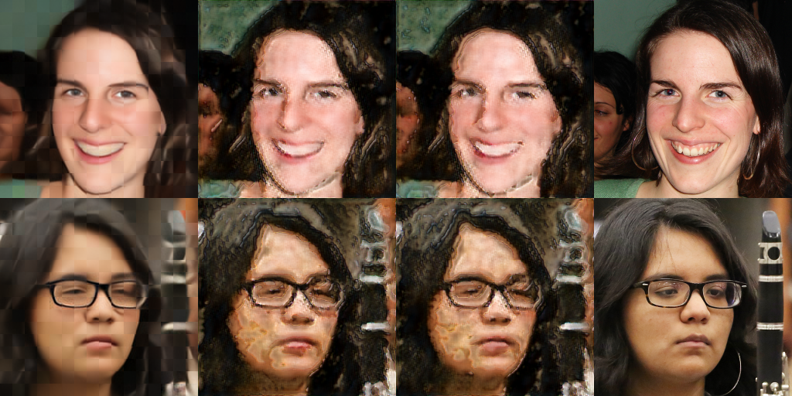
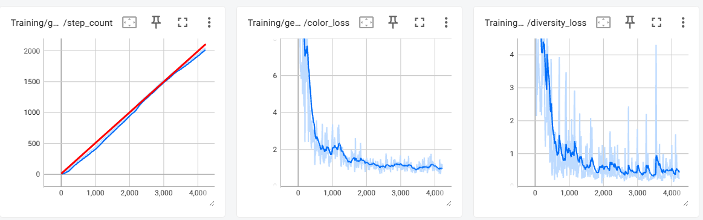

# Just-In-Time Dynamic Codebooks for Generative Modeling
### Per-patch candidate generation with single-head multiple-choice learning
Eugene Raether, AI Engineer & Researcher @ Qualia Tensor LLC

## Introduction
This document details the creation of a novel image generation pipeline for the express purpose of generating high quality images.  It is a portfolio piece, demonstrating the ability to ideate, write, train, and deploy multiple deep learning models end to end as one coherent pipeline.

Countless models were trained and tweaked to narrow everything down to three models and the current hierarchical training paradigm.  While the dataset used here is simple, this technique can be extended into any continuous domain or modality.

This technique can be thought of as the midpoint between the continuous nature of diffusion models and the discrete sampling of hierarchical vqvaes.

### The actual engineering effort
1) While countless models and scripts were trained, the final published code contains the training and inference code for 3 distinct models in the main pipeline.
	- Autoencoder
	- Context-Aware Dynamic Vocabulary Generator
	- MaskGIT-like predictor making discrete predictions over dynamic vocabulary

2) Wrote and trained 3 more models in pytorch to explore different generation techniques
	- Diffusion Model
	- Rectified Flow Model
	- VQVAE
3) Wrote inference code and tracked PSNR, FID, and other metrics
4) <TODO: Deployed models onto AWS, Azure, and GCP>

### The Research Effort
1) Ideated, trained, and investigated a novel training regime for a brand new generation technique.

While the main technique is the main topic of this portfolio piece, there are also a few other inventions investigated as part of this work.
1) Multiple hypothesis generation using a single output head with no additional loss terms.
2) Training a VQVAE without codebook collapse using dropout with no additional loss terms.
3) Convolutional Attention (Query is a 3x3 matrix instead of a 1x1 dot product, strict superset of attention)

## Results
<TBD, models need to finish training (few days)>

## How this works (high level)

Step 1: Train autoencoder.

Step 2: Train dynamic vocabulary generator.  For each spatial patch, train a model to generate a small *local* codebook on demand -- 8 per-token candidate latent vectors conditioned on the global context.

Step 3: Train model to predict which of the 8 candidates is closest.

Step 4: Repeat steps 2 and 3 until you have a converged, coarse latent

This technique is *hierarchical*, so you start with a 4x4 seed latent and progressively expand and refine this latent until you have a 64x64 set of latents which are then decoded into a 512x512 image.

## Dynamic Vocabulary Generator
### Arguably the most interesting part of this project

The largest technical contribution of this project is **multiple-choice learning from a single output head.** Standard MCL uses one head per candidate with careful loss balancing to keep heads from dominating one another. This project produces 8 candidates through a shared pathway, such that every model parameter receives a gradient from every sample -- no balancing losses and no per-head bookkeeping.

This is possible by first passing all tokens through a shared trunk, where they can mix (this project uses a CNN, but a ViT is fine).  Then, each token becomes 8 differently noised features.  These 8 features then push each other apart to cover the possibility space through self-attention.  What you end up with is not 8 modes but 8 centroids that cover the possibility space.

These 8 points jointly minimize expected closest-candidate loss against whatever the ground-truth latent turns out to be.  They are, effectively, 8 centroids covering the local conditional distribution.

### Visualization of the Mechanism

To help visualize the mechanism, here is a slightly different model (ViT, 16 guesses, starting from all zeros).  This was the model trained before the current hierarchical one.

The diagram shows the following.  The bottom row shows the per-patch variance of the generated candidate latents.  The top row shows the decoded latents after a single additional full pass (bidirectionally sampling all 256 latents one by one).

As you can see, initially, the variance is very high (as the latent generator has zero context).  However, the variance rapidly plummets in most areas of the image as the model goes from 'generative mode' to 'refinement mode'.  This makes sense from a mutual information standpoint.  Most of the difficulty in generation is the global structure.  Once the global structure exists, most information is local refinement.  (This is what hierarchical VQVAEs bank on).

Interestingly, the variance of the latents that make up the face are lower unconditionally.  This is almost certainly an artifact of the FFHQ face centering, and is unlikely to show up in a less structured dataset (although even a complex dataset might have different statistics at the edges). 

While the above shows the variance, the following diagram shows the PSNR of the Latents themselves.  Note that this is in tanh latent space, not color space.

This suggests that most of the value is captured with 6 refinement steps, with the variance too high to meaningfully converge beyond 6.  

I initially hypothesized that this might have been due to an overly aggressive training regime, where 0-20% of the time, a random candidate latent is chosen instead of the closest candidate latent at any given refinement step as this creates a fundamental noise floor.

However, training with 0% random candidate selection, this exact same refinement convergence was still observed.  This leads me to believe that the actual issue is that what remains is, essentially, disjoint noise after all mutual information is resolved.  And, with 16 samples, sampling from this disjoint noise gives ~4 bits of information.  In essence, the PSNR curve is not actually flat, it is simply shallow.  The 32x32x3 patch represented by each latent has very very high information content in comparison (24.5kb @ 8 bits / channel).  Which means that resolving this would actually take thousands of steps, even if all of the latents can be resolved simultaneously.

While this technique essentially resolves all mutual information, a different approach is needed to get higher fidelity and resolve the per-latent noise floor.  Either you do this same technique with smaller and smaller patches (aka hierarchical), or you skip straight to the end with a cGAN.  This project uses the hierarchical technique.  The autoencoder, the vocabulary generator, and the predictor can handle any size latent from 4x4 to 64x64.

### Is the Predictor Truly Necessary?

In theory, since the vocab generator creates conditional k-means centroids, the solution it should converge to should be the centroids covering roughly equal area in probability space, as leaving modes uncovered could result in large loss.  So, you should be able to sample at random and each centroid should cover roughly the same amount of probability mass.

However, there are two issues with this line of thinking.

1) The centroids are not of probability mass, they are of MSE distance.  So rare, distant modes get outsized impact.

2) This process is a refinement chain.  The current setup works because this chain is very shallow (2 steps @ 4x4, 2 steps @ 8x8, etc. for 10 steps total).  Since all of the vocab is a joint distribution (if we commit to one token implying red hair, we can't just sample a nearby token for brown hair), if we started sampling we would need to regenerate the vocab every sampling step, and our chain would grow to hundreds or thousands of steps long.

The reason why diffusion can get away with this is because diffusion CAN jump straight to step 800.  We know exactly how much noise 'should' be there, so we know how much to subtract.  Of course, that's only in theory.  In practice diffusion models have extremely high exposure bias.  This model, by maintaining a true chain, tries to minimize said bias.  Still, it is interesting to think about what it would take to only use the vocab generator for generation.

---

## Pipeline Overview

### Stage 1 -- Continuous Autoencoder (~20M params)
- **Purpose:** Learn a structured latent bottleneck.
- **Architecture:** image -> patchify (downscale factor of 8) -> 6 MLP encoder layers → tanh bottleneck (64 dim) → single 3x3 conv -> 6 MLP decoder layers.
- **Loss:** Smooth L1.
- **Training:** 3 hours on 1x4090.

Each 8x8 patch becomes a token, which is then processed and eventually decoded back into an 8x8 patch.  The network is trained on images downscaled by 1x, 2x, 4x, 8x, and 16x, which means the internal representation goes from 4096 tokens at 1x to only 16 tokens at 16x downscale.  However, since this model is almost entirely an MLP the variability largely doesn't matter (although, lower resolutions have higher variation, and so, get lower PSNR).

The MLP is exactly a sequence of feed-forward layers from transformer land (RMSNorm followed by a SwiGLU).  Works fine for image data.

PSNR over 1000 samples:
ae/downscaled_1/psnr:      34.388
ae/downscaled_2/psnr:      32.497
ae/downscaled_4/psnr:      30.619
ae/downscaled_8/psnr:      28.282
ae/downscaled_16/psnr:     26.118

[Link to Autoencoder](./code/hierarchical_stage_1_autoencoder_mlp.py)

### Stage 2 -- Just-in-Time Candidate Generator (~350M)
- **Purpose:** Produce 8 candidate latents per patch that cover the local conditional distribution.
- **Architecture:** CNN-MLP trunk -> each token becomes 8 noised hidden states -> self-attention between 8 samples so that network learns to cover modes
- **Loss:** Smooth L1 between ground-truth latent and closest candidate (Winner-Take-All), with 90/10 winner/random input mixing at refinement boundaries.
- **Training:** 15 hours on 1x4090.  16x,8x,4x,2x downscale trained to partial convergence first (10 hours), 1x added after due to being heavier computationally (5 hours).

This method is similar to IMLE (Implicit Maximum Likelihood Estimation, Li & Malik, 2018), in the sense that noise is used to generate samples that implicitly match the density.  This work improves on this result through self-attention between samples, thereby transforming the procedure into conditional k-means.

Because there is only a single output head and the samples are generated through noise, there cannot be gradient starvation, which means that any sort of notion of load-balancing is not required.  The model simply learns the conditional density by trying to minimize WTA loss.

While a ViT might, at the limit, result in better estimation of the conditional density, the 7-layer CNN still allows for global mixing at the 4x4 and 8x8 levels, and gives a nice narrowing of the receptive field exactly as the focus becomes more and more on local detail refinement.

Losses:
loss_16_0:   7.929   ( --- )
loss_16_1:   5.427   (31.56% drop)
loss_8_0:    4.254   (21.61% drop)
loss_8_1:    3.229   (24.09% drop)
loss_4_0:    2.624   (18.74% drop)
loss_4_1:    2.000   (23.78% drop)
loss_2_0:    1.653   (17.35% drop)
loss_2_1:    1.269   (23.23% drop)
loss_1_0:    1.113   (12.29% drop)
loss_1_1:    0.886   (20.40% drop)

Interestingly, the refinements (\_0 -> \_1) have bigger drops compared to the upscales (\_1 -> \_0).  This is perhaps because there is more ambiguity when upscaling.  Or, perhaps, the method by which upscaling happens (simply a `.repeat()`) needs to change.

[Link to Candidate Generator](./code/hierarchical_stage_2_vocabulary_generator_cnn.py)

### Stage 3 -- Categorical Predictor (~1.1B params)
- **Purpose:** Given 8 candidates per patch, pick one.
- **Architecture:** CNN-MLP trunk
- **Loss:** Cross-entropy against the index of the candidate closest to the ground-truth latent.
- **Training:** <TBD>

The vocabulary generator is mode covering, the predictor assigns the different modes actual probability mass.

A CNN is chosen specifically because it allows for parallel sampling.  The model uses 7 convolutions, which means that the receptive field of tokens is 15.  Therefore, if we sample at position (0,0), we can also sample at positions (16,16), (16,0), (0,16), (32,0), (32,16), etc.  In essence, at higher resolutions we can resolve all samples with, at most, 256 (16x16) inference steps.

[Link to Candidate Predictor](./code/hierarchical_stage_3_predictor_cnn.py)

## Inference: Iterative Refinement

Terminology, since "step" gets overloaded:

- **Token:** one of the 8x8 patches in the latent grid.
- **Full Pass:** Stage 2 runs once (regenerating 16 candidates for every patch), then Stage 3 runs up to 256 times.  257 forward passes total.  Adaptive-order (entropy-based) autoregression.

During the full pass, the index of which token to sample is based on **minimum entropy**.  Aka, the most confident token is the one that's chosen to be sampled next.  Because the codes are 'just-in-time', no top-p or top-k is used because all candidates should be relevant.  Temperature is kept at 1.0.  This, empirically, leads to better sampling.  However, there are also ablations using random sampling.

Inference is optimized using @torch.compile and bfloat16 autocasting.

The intermediate version between these two extremes (adaptive-order autoregression and full-parallel sampling), would be to sample in batches (e.g. MaskGIT-like).  I believe this is likely the broadly correct answer, and depends on an empirical assessment of mutual information at each stage.  Low mutual information means high parallelization, high mutual information means low parallelization.  Finding the right balance minimizes inference time while maintaining sample quality.  Mutual information cannot directly be computed from entropy, however.

## Inference
6 full passes, 0 global refinement passes, entropy-based sampling

Due to low number of full passes, the output remains blurry.  Still, there is good global structure forming.  The faces have less entropy than the background, and are therefore easier to generate with fewer full sampling steps.

## Inference Ablations

1 full pass (1+256), 9 global refinement passes (9+9) = 10 stage 2, 265 stage 3 forward passes, entropy-based sampling.  5.6x speedup over 6 full passes:

A lack of some global structure can be seen.  Eyes differing sizes, hair is two-toned, etc.

----

6 full passes 0 refinement passes (6 stage 2, 1536 stage 3 forward passes), but selecting which spot to sample is chosen randomly, instead of based on lowest entropy:

More artifacting compared to sampling the lowest-entropy tokens first.

----
Entropy sampling, 6 full passes, 0.5 temperature:

Very simple backgrounds.

----

Entropy sampling, 6 full passes, 1.5 temperature:

Chaotic, dream-like outputs.

---

## Improvements and Ablations

### CNN -> ViT
One obvious improvement would be switching to a ViT.  Technically, the nice property of the CNN having a maximum receptive field that allows sampling in parallel is not actually a 'real' property.  Distant tokens still have mutual information, that mutual information is simply unavailable between more distant tokens, which a ViT would be able to resolve.  However, it is genuinely unclear if this is actually needed for this project, as coarse mutual information is resolved at the 4x4 and 8x8 steps.  In a sense, the CNN gives a nice inductive bias that seems approximately correct, focusing attention down at higher and higher resolutions.  A ViT could feasibly learn even better connections, but I don't anticipate them being significantly better without much more training.  However, for a more difficult, more variable dataset, it seems likely to me that long range depencies could be a big win, especially for global consistency in things like text rendering, comics, etc.

## FID / IS

Because the dynamic vocabulary produces centroids, it is impossible to go from coarse vocabulary to photorealistic images.  FID/IS would be much more meaningful run on a converged GAN, or at high resolution converged latents.  Nevertheless, FID/IS was run provisionally on partially converged 16x16 coarse latents.

FID run on 5000 output images (only coarse latents):  66.27; calculated using `torch_fidelity`.
The score is likely high due to artifacting / patch edge boundaries when decoding.

FID run on 5000 output images (full pipeline; coarse latents -> GAN): <TBD>

IS on 5000 output images: 3.759 ± 0.062
For reference, stylegan2 has an IS of 5.13 ± 0.02
It is difficult to interpret this value.  I find it likely that, due to the unconverged backgrounds in these outputs, that InceptionV3 classifies these images into a smaller variety of classes, rather than this being an issue of mode collapse.

# Experiments

## GAN
A cGAN could feasibly allow for a direct jump from partially converged latents to photorealistic images.  It would essentially be responsible for adding high-frequency detail that would otherwise need to be sampled at finer and finer resolutions to be resolved.  This could cut the 32x32 and 64x64 resolutions of the pipeline (most of the computational burden).

A GAN typically requires tens of thousands (to sometimes even hundreds of thousands of steps) to resolve.  This is outside the computational budget for now.  The following is a result after just ~2000 steps (a step is counted as one discriminator and one generator update).  Decent for normal training, very, very low for a gan, which is why it has not yet converged.

Column 1 is the coarse, decoded latent.
Column 2 is fake sample 1.
Column 3 is fake sample 2.
Column 4 is the ground truth.

While the quality is quite low due to lack of convergence, you can see that the GAN is starting to learn texture as well as hallucinate extra detail.  There is noticeable diversity between the two samples, but the two aren't overly different, which is exactly what the diversity loss enforces.

### How the GAN Works

The GAN is a normal-ish adaptive / scheduled cGAN.  The conditioning (the coarse decoded image), is fed to both the discriminator and the generator.

Generator Input:
1) The coarse image (rgb, not latents)
2) Noise

Generator Output:
1) Fake Image

Discriminator Input:
1) The coarse image (rgb, not latents)
2) Image to Evaluate (real or fake) (rgb)

Discriminator Output:
1) binary logit

What makes this setup perhaps somewhat unique is the scaffolding around it.  First, the discriminator is trained until it can separate real from fake with 85% accuracy.  Only then does the generator train on this working discriminator.  This allows the model to train without extra stabilization (e.g. spectral norms, gradient-penalty, 1-Lipschitz).

The idea is that the generator trains with real signal every time.  And when it learns to defeat the discriminator (discriminator accuracy drops below 85%), the discriminator is trained back up until it's providing real signal again.

#### Extra Losses
There are two extra loses used for the GAN.

The first is a (very) large MSE color loss -- 50x MSE between a very downscaled version (512x512 -> 8x8) of the generated image and the real image.  Downscaled so that only the coarse colors need to be correct, without the blur that would arrive if this were full resolution regression.  And 50x because this MSE loss decreases over time (as the model learns to satisfy this constraint).  Eventually, this loss becomes small relative to the magnitude of the discriminator loss, and so the model starts to drift by trading off color loss for discriminator loss.  The 50x ensures that this drift is very small around the actual solution, even when the model is mostly converged.

The second is a diversity loss, and is *also* very large for this exact same reason.  `F.mse((diff - 0.2)/0.2)\*50` which ensures the samples the generator produces are different by a constant rate (0.2 across normalized channels represents roughly a 10/255 rgb difference per channel).  This is mostly to allow the high frequency noise (the source of high frequency detail), a chance to survive being passed through the pipeline without being optimized to zero or needing to be injected every layer.  This value is quite hard to optimize a multiplier for.  Too high and the model simply maximizes diversity, too low and it disappears.  The value essentially directly determines sample diversity.  Arguably, the noise injection mlp should probably have a different optimizer (high beta_1 / ema; e.g. `0.99`), since the amount of diversity shouldn't be based on the current discriminator state.

#### Optimizer

The optimizer used is AdamW, which differs from the schedulefree optimizer used to train all other models.  The switchup is because there is a constant moving target for both the generator and discriminator rather than a fixed point to converge to.  The optimizer uses a somewhat standard `beta_1` of `0.5` so that both networks can rapidly adapt to a moving target.  `beta_2` remains high (`0.999`) to ensure that gradient variance remains accurate.

No other stabilization is used, other than maintaining a low LR for both the discriminator & generator.  Too high of an LR results in catastrophic forgetting / looping without progress. Too low of an LR results in slow training.  LR used: 0.00005.  I believe this is slightly too high, but it is in the correct ballpark.  This caps quality, but so does the number of layers and the hidden dim, and I would say that those should be increased first.

TTUR was considered (discriminator LR 2-4x higher than generator LR), but since the training is adaptive this is not actually necessary.  Also, a higher discriminator LR results in lower overall quality due to lower samples before catastrophic forgetting kicks in, necessitating more of a tournament setup (keeping track of older generators / older fake samples).

### Considered Ablations
These would be useful to run with more compute / time.

1) Add gradient penalty to discriminator, WGAN style
2) Make model bigger (double hidden dim)
3) Lower LR; more steps

### Training Graphs

The first graph shows the step count for the generator relative to total iterations.  The red line represents the midpoint (50/50 updates between discriminator and generator).  The generator step count is close to this line, but generally below it, indicating that the discriminator needs more steps than the generator to maintain accuracy.

The second and third graphs are the color and diversity losses.  Despite being massive (50x), they converge to roughly where one would expect, to within the same magnitude as the discriminator loss.  Which is precisely why the large multiplier is used, as, otherwise, color and diversity would be able to drift far more over the course of training and stop stabilizing the constraint they're enforcing.

## VQVAE

While not directly used in this project, a VQVAE was also trained.  I include it here because it's an interesting result -- I was able to train a VQVAE purely through dropout and no other regularization terms.  It is an interesting research direction, although I believe it would likely require codebook reinitialization for dead codes to give better codebook efficiency.

Instead of simply snapping to the nearest code, the model outputs a probability distribution over 1024 codes.  We take the argmax to use as the hard-quantized value, and the softmax to use as the soft value to backpropagate, using the straight-through estimator trick.

The intuition for what the model learns to do.  Since any code it wants to use could be dropped out at any time, the model essentially learns a sort of ranked choice voting, where it's #1 candidate has the highest logit, it's #2 candidate second highest, etc.  And so codes end up training.

This is two-phase training.  The first is the exploration phase, with 90% dropout at the bottleneck.  The second is the exploitation phase, with 0% dropout.

The total loss drop is instant.  The second we switch over, the loss drops significantly.  This implies that the model 'knows' what the right answer is, it simply can't actually select the right answer due to the right answer being dropped out with 90% probability.

Interestingly, code collapse seems to happen right away (steps 0 to 300, 1024 -> 680 codes).  But instead of falling to true collapse (5-20 codes used out of 1024), it stabilizes at 680 codes and then starts to increase to 720 codes.  Given the trendline I see no reason why this couldn't have continued with more training.

Although perhaps strange, this makes sense to me.  The high dropout forces the model to explore codes that might not be its first (or even tenth) pick, thereby allowing rare codes to get signal.  As these rarer codes get more signal, they start to drift towards more useful values, at which point they can start to specialize.

Once the regime changes from exploration to exploitation (90% dropout to 0% dropout), nothing is forcing the model to explore, the gradients concentrate on the codes already in use, and there will likely be an indefinite narrowing of codes towards some base level.  However, if there is already a good spread of codes being used every single minibatch, those codes will continue to receive signal, and the model seems unlikely to drop them.

Therefore, the goal should be: train in the high dropout regime for as long as possible, before cutting over and training with 0% dropout, keeping track of the loss and halting training at the perigee.

It is not actually clear if code reinitialization is fully required, as the model tends to simply learn to use more codes over time as it is forced to use them.  However, it might help.

A bigger batch size will keep more codes alive.  A bigger number of tokens passing through the bottleneck will keep more codes alive.

PSNR over 1000 samples:
ae/downscaled_1/psnr:      27.062
ae/downscaled_2/psnr:      25.203
ae/downscaled_4/psnr:      23.316
ae/downscaled_8/psnr:      20.898
ae/downscaled_16/psnr:     19.178
vqvae/unique_codes:        541

compression ratio: ~75x at full resolution (~350 kB (512x512 .png filesize) -> 4.5kB (4096 codes \* 9 bits/code))

[Link to VQVAE Code](./code/vqvae_test.py)

## DIFFUSION

Hyperspherical diffusion (latents lie on a hypersphere)
<Example of Diffusion>

## Rectified Flow

<Example of Rectified Flow>